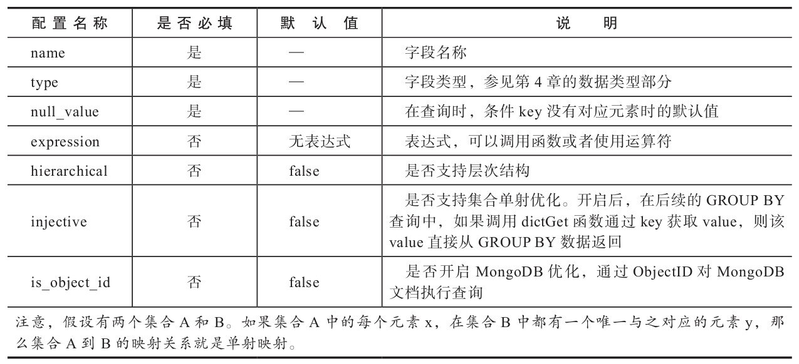
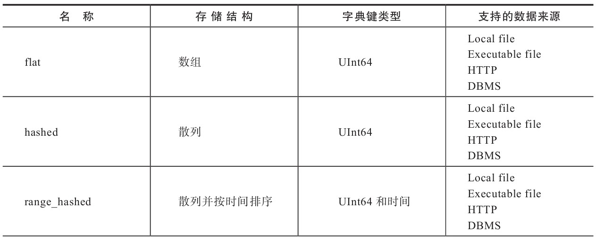
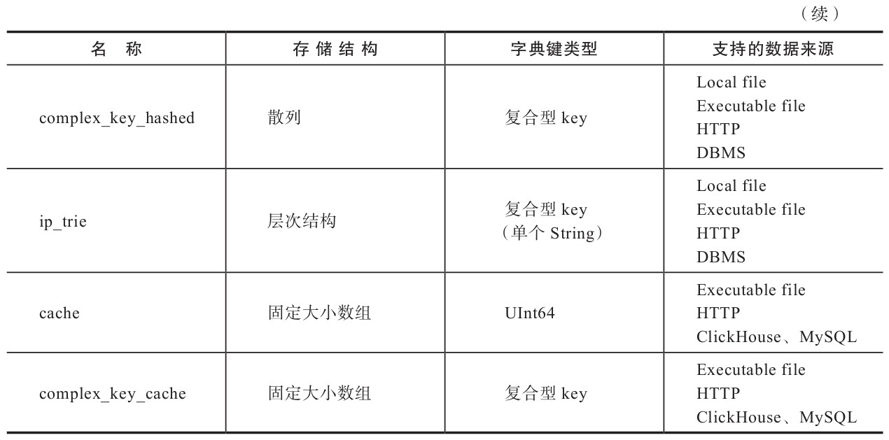
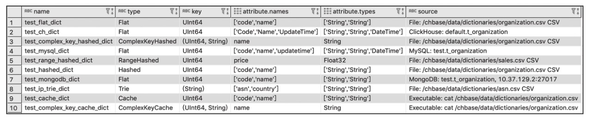

- [外部扩展字典](#外部扩展字典)
  - [准备字典数据](#准备字典数据)
  - [扩展字典配置文件的元素组成](#扩展字典配置文件的元素组成)
  - [扩展字典的数据结构](#扩展字典的数据结构)
  - [扩展字典的类型](#扩展字典的类型)
  - [扩展字典的数据源](#扩展字典的数据源)
  - [扩展字典的数据更新策略](#扩展字典的数据更新策略)
  - [扩展字典的基本操作](#扩展字典的基本操作)

# 外部扩展字典

外部扩展字典是以插件形式注册到ClickHouse中的，由用户自行定义数据模式及数据来源。

目前扩展字典支持7种类型的内存布局和4类数据来源。相比内容十分有限的内置字典，扩展字典才是更加常用的功能。

## 准备字典数据

在接下来的篇幅中，会逐个介绍每种扩展字典的使用方法，包括它们的配置形式、数据结构及创建方法，但是在此之前还需要进行一些准备工作。

为了便于演示，此处事先准备了三份测试数据，它们均使用CSV格式。

其中，第一份是企业组织数据，它将用于`flat`、`hashed`、`cache`、`complex_key_hashed`和`complex_key_cache`字典的演示场景。

这份数据拥有`id`、`code`和`name`三个字段，数据格式如下所示：

```python
1,"a0001","研发部"
2,"a0002","产品部"
3,"a0003","数据部"
4,"a0004","测试部"
5,"a0005","运维部"
6,"a0006","规划部"
7,"a0007","市场部"
```

第二份是销售数据，它将用于range_hashed字典的演示场景。这份数据拥有id、start、end和price四个字段，数据格式如下所示：

```python
1,2016-01-01,2017-01-10,100
2,2016-05-01,2017-07-01,200
3,2014-03-05,2018-01-20,300
4,2018-08-01,2019-10-01,400
5,2017-03-01,2017-06-01,500
6,2017-04-09,2018-05-30,600
7,2018-06-01,2019-01-25,700
8,2019-08-01,2019-12-12,800
```

最后一份是asn数据，它将用于演示ip_trie字典的场景。这份数据拥有ip、asn和country三个字段，数据格式如下所示：

```python
"82.118.230.0/24","AS42831","GB"
"148.163.0.0/17","AS53755","US"
"178.93.0.0/18","AS6849","UA"
"200.69.95.0/24","AS262186","CO"
"154.9.160.0/20","AS174","US"
```

可以从下面的地址获取到上述三份数据：

- <https://github.com/nauu/clickhousebook/tree/master/dict/plugin/testdata/organization.csv>
- <https://github.com/nauu/clickhousebook/tree/master/dict/plugin/testdata/sales.csv>
- <https://github.com/nauu/clickhousebook/tree/master/dict/plugin/testdata/asn.csv>

下载后，将数据文件上传到ClickHouse节点所在的服务器即可。

## 扩展字典配置文件的元素组成

扩展字典的配置文件由config.xml文件中的dictionaries_config配置项指定：

```xml
<!-- Configuration of external dictionaries. See:
https://clickhouse.yandex/docs/en/dicts/external_dicts/
-->
<dictionaries_config>*_dictionary.xml</dictionaries_config>
```

在默认的情况下，ClickHouse会自动识别并加载/etc/clickhouse-server目录下所有以_dictionary.xml结尾的配置文件。

同时ClickHouse也能够动态感知到此目录下配置文件的各种变化，并支持不停机在线更新配置文件。

在单个字典配置文件内可以定义多个字典，其中每一个字典由一组dictionary元素定义。在dictionary元素之下又分为5个子元素，均为必填项，它们完整的配置结构如下所示：

```xml
<?xml version="1.0"?>
<dictionaries>
  <dictionary>
    <name>dict_name</name>

    <structure>
      <!-- 字典的数据结构 -->
    </structure>

    <layout>
      <!-- 在内存中的数据格式类型 -->
    </layout>

    <source>
    <!-- 数据源配置 -->
    </source>

  <lifetime>
    <!-- 字典的自动更新频率 -->
  </lifetime>
  </dictionary>
</dictionaries>
```

在上述结构中，主要配置的含义如下。

- **name**：字典的名称，用于确定字典的唯一标识，必须全局唯一，多个字典之间不允许重复。
- **structure**：字典的数据结构，5.2.3节会详细介绍。
- **layout**：字典的类型，它决定了数据在内存中以何种结构组织和存储。目前扩展字典共拥有7种类型，5.2.4节会详细介绍。
- **source**：字典的数据源，它决定了字典中数据从何处加载。目前扩展字典共拥有文件、数据库和其他三类数据来源，5.2.5节会详细介绍。
- **lifetime**：字典的更新时间，扩展字典支持数据在线更新，5.2.6节会详细介绍。

## 扩展字典的数据结构

扩展字典的数据结构由structure元素定义，由键值key和属性attribute两部分组成，它们分别描述字典的数据标识和字段属性。structure的完整形式如下所示（在后面的查询过程中都会通过这些字段来访问字典中的数据）：

```xml
<dictionary>
  <structure>
    <!-- <id> 或 <key> -->
    <id> 
      <!--Key属性-->
    </id>

    <attribute>
      <!--字段属性-->
    </attribute>
    ...
    </structure>
    </dictionary>
```

1. **key**

    key用于定义字典的键值，每个字典必须包含1个键值key字段，用于定位数据，类似数据库的表主键。键值key分为数值型和复合型两类。

    （1）**数值型**：数值型key由UInt64整型定义，支持flat、hashed、range_hashed和cache类型的字典（扩展字典类型会在后面介绍），它的定义方法如下所示。

    ```xml
    <structure>
        <id>
            <!—名称自定义-->
            <name>Id</name>
        </id>
        省略…
    ```

    （2）复合型：复合型key使用Tuple元组定义，可以由1到多个字段组成，类似数据库中的复合主键。它仅支持complex_key_hashed、complex_key_cache和ip_trie类型的字典。其定义方法如下所示。

    ```xml
    <structure>
        <key>
            <attribute>
            <name>field1</name>
            <type>String</type>
            </attribute>
            <attribute>
            <name>field2</name>
            <type>UInt64</type>
            </attribute>
            省略…
        </key>
        省略…
    ```

2. **attribute**

    attribute用于定义字典的属性字段，字典可以拥有1到多个属性字段。它的完整定义方法如下所示：

    ```xml
    <structure>
        省略…
        <attribute>
            <name>Name</name>
            <type>DataType</type>
            <!—空字符串-->
            <null_value></null_value>
            <expression>generateUUIDv4()</expression>
            <hierarchical>true</hierarchical>
            <injective>true</injective>
            <is_object_id>true</is_object_id>
        </attribute>
        省略…
    </structure>
    ```

    在attribute元素下共有7个配置项，其中name、type和null_value为必填项。这些配置项的详细说明如表所示。

    

## 扩展字典的类型

扩展字典的类型使用layout元素定义，目前共有7种类型。

一个字典的类型，既决定了其数据在内存中的存储结构，也决定了该字典支持的key键类型。

根据key键类型的不同，可以将它们划分为两类：

一类是以flat、hashed、range_hashed和cache组成的单数值key类型，因为它们均使用单个数值型的id；

另一类则是由complex_key_hashed、complex_key_cache和ip_trie组成的复合key类型。

complex_key_hashed与complex_key_cache字典在功能方面与hashed和cache并无二致，只是单纯地将数值型key替换成了复合型key而已。

1. **flat**

    flat字典是所有类型中性能最高的字典类型，它只能使用UInt64数值型key。

    顾名思义，flat字典的数据在内存中使用数组结构保存，数组的初始大小为1024，上限为500000，这意味着它最多只能保存500000行数据。

    如果在创建字典时数据量超出其上限，那么字典会创建失败。代码清单所示是通过手动创建的flat字典配置文件。

    ```xml
    <?xml version="1.0"?>
    <dictionaries>
        <dictionary>
            <name>test_flat_dict</name>
            <source>
            <!-- 准备好的测试数据-->
            <file>
            <path>/chbase/data/dictionaries /organization.csv</path>
            <format>CSV</format>
            </file>
            </source>
        <layout>
            <flat/>
        </layout>
        <!--与测试数据的结构对应-->
        <structure>
            <id>
            <name>id</name>
            </id>
            <attribute>
            <name>code</name>
            <type>String</type>
            <null_value></null_value>
            </attribute>
            <attribute>
            <name>name</name>
            <type>String</type>
            <null_value></null_value>
            </attribute>
        </structure>
        <lifetime>
            <min>300</min>
            <max>360</max>
        </lifetime>
        </dictionary>
    </dictionaries>
    ```

    在上述的配置中，source数据源是CSV格式的文件，structure数据结构与其对应。

    将配置文件复制到ClickHouse服务节点的/etc/clickhouse-server目录后，即完成了对该字典的创建过程。

    查验`system.dictionaries`系统表后，能够看到flat字典已经创建成功。

    ```sql
    SELECT name, type, key, attribute.names, attribute.types FROM system.dictionaries
    
    ┌─name───────────┬─type─┬─key────┬─attribute.names──┐
    │ test_flat_dict │ Flat │ UInt64 │ ['code','name']  │
    └────────────────┴──────┴────────┴──────────────────┘
    ```

2. **hashed**

    hashed字典同样只能够使用UInt64数值型key，但与flat字典不同的是，hashed字典的数据在内存中通过散列结构保存，且没有存储上限的制约。代码清单5-2所示是仿照flat创建的hashed字典配置文件。

    ```xml
    <?xml version="1.0"?>
    <dictionaries>
        <dictionary>
            <name>test_hashed_dict</name>
            与flat字典配置相同,省略…
            <layout>
            <hashed/>
            </layout>
            省略…
        </dictionary>
    </dictionaries>
    ```

    同样将配置文件复制到ClickHouse服务节点的/etc/clickhouse-server目录后，即完成了对该字典的创建过程。

3. **range_hashed**

    range_hashed字典可以看作hashed字典的变种，它在原有功能的基础上增加了指定时间区间的特性，数据会以散列结构存储并按照时间排序。时间区间通过range_min和range_max元素指定，所指定的字段必须是Date或者DateTime类型。

    现在仿照hashed字典的配置，创建一个名为test_range_hashed_dictionary.xml的配置文件，将layout改为range_hashed并增加range_min和range_max元素。它的完整配置如代码清单5-3所示。

    ```xml
    <?xml version="1.0"?>
    <dictionaries>
        <dictionary>
            <name>test_range_hashed_dict</name>
            <source>
            <file>
            <path>/chbase/data/dictionaries/sales.csv</path>
            <format>CSV</format>
            </file>
            </source>
        <layout>
            <range_hashed/>
        </layout>
        <structure>
            <id>
            <name>id</name>
            </id>
            <range_min>
            <name>start</name>
            </range_min>

            <range_max>
            <name>end</name>
            </range_max>

            <attribute>
            <name>price</name>
            <type>Float32</type>
            <null_value></null_value>
            </attribute>      
        </structure>
        <lifetime>
            <min>300</min>
            <max>360</max>
        </lifetime>
        </dictionary>
    </dictionaries>
    ```

    在上述的配置中，使用了一份销售数据，数据中的start和end字段分别与range_min和range_max对应。将配置文件复制到ClickHouse服务节点的/etc/clickhouse-server目录后，即完成了对该字典的创建过程。查验system.dictionaries系统表后，能够看到range_hashed字典已经创建成功：

    ```sql
    SELECT name, type, key, attribute.names, attribute.types FROM system.dictionaries

    ┌─name───────────────────┬─type────────┬─key────┬─attribute.names──┐
    │ test_range_hashed_dict │ RangeHashed │ UInt64 │ ['price']        │
    └────────────────────────┴─────────────┴────────┴──────────────────┘
    ```

4. **cache**

    cache字典只能够使用UInt64数值型key，它的字典数据在内存中会通过固定长度的向量数组保存。定长的向量数组又称cells，它的数组长度由size_in_cells指定。而size_in_cells的取值大小必须是2的整数倍，如若不是，则会自动向上取为2的倍数的整数。

    cache字典的取数逻辑与其他字典有所不同，它并不会一次性将所有数据载入内存。当从cache字典中获取数据的时候，它首先会在cells数组中检查该数据是否已被缓存。如果数据没有被缓存，它才会从源头加载数据并缓存到cells中。所以cache字典是性能最不稳定的字典，因为它的性能优劣完全取决于缓存的命中率（缓存命中率=命中次数/查询次数），如果无法做到99%或者更高的缓存命中率，则最好不要使用此类型。代码所示是仿照hashed创建的cache字典配置文件。

    ```xml
    <?xml version="1.0"?>
    <dictionaries>
        <dictionary>
            <name>test_cache_dict</name>
            <source>
            <!—- 本地文件需要通过 executable形式 -->
            <executable>
            <command>cat /chbase/data/dictionaries/organization.csv</command>
            <format>CSV</format>
            </executable>
        </source>
        <layout>
        <cache>
            <!—- 缓存大小  -->
            <size_in_cells>10000</size_in_cells>
        </cache>
        </layout>
        省略…
        </dictionary>
    </dictionaries>
    ```

    在上述配置中，layout被声明为cache并将缓存大小size_in_cells设置为10000。关于cells的取值可以根据实际情况考虑，在内存宽裕的情况下设置成1000000000也是可行的。还有一点需要注意，如果cache字典使用本地文件作为数据源，则必须使用executable的形式设置。

5. **complex_key_hashed**

    complex_key_hashed字典在功能方面与hashed字典完全相同，只是将单个数值型key替换成了复合型。代码清单5-5所示是仿照hashed字典进行配置后，将layout改为complex_key_hashed并替换key类型的示例。

    ```xml
    <?xml version="1.0"?>
    <dictionaries>
        <dictionary>
            <name>test_complex_key_hashed_dict</name>
            <!—-  与hashed字典配置相同,省略…-->
            <layout>
            <complex_key_hashed/>
            </layout>        
            <structure>
            <!—- 复合型key  -->
            <key>
                <attribute>
                <name>id</name>
                <type>UInt64</type>
                </attribute>
                <attribute>
                <name>code</name>
                <type>String</type>
                </attribute>
            </key>
            省略…
            </structure>
            省略…
    ```

    将配置文件复制到ClickHouse服务节点的/etc/clickhouse-server目录后，即完成了对该字典的创建过程。

6. **complex_key_cache**

    complex_key_cache字典同样与cache字典的特性完全相同，只是将单个数值型key替换成了复合型。现在仿照cache字典进行配置，将layout改为complex_key_cache并替换key类型，如代码清单5-6所示。

    ```xml
    <?xml version="1.0"?>
    <dictionaries>
        <dictionary>
            <name>test_complex_key_cache_dict</name>
            <!-- 与cache字典配置相同,省略…-->
            <layout>
            <complex_key_cache>
                <size_in_cells>10000</size_in_cells>
            </complex_key_cache>
            </layout>
            <structure>
            <!-- 复合型Key  -->
            <key>
                <attribute>
                <name>id</name>
                <type>UInt64</type>
                </attribute>
                <attribute>
                <name>code</name>
                <type>String</type>
                </attribute>
            </key>
            省略…
            </structure>
            省略…
    ```

    将配置文件复制到ClickHouse服务节点的/etc/clickhouse-server目录后，即完成了对该字典的创建过程。

7. **ip_trie**

    虽然同为复合型key的字典，但ip_trie字典却较为特殊，因为它只能指定单个String类型的字段，用于指代IP前缀。ip_trie字典的数据在内存中使用trie树结构保存，且专门用于IP前缀查询的场景，例如通过IP前缀查询对应的ASN信息。它的完整配置如代码清单5-7所示。

    ```xml
    <?xml version="1.0"?>
    <dictionaries>
        <dictionary>
            <name>test_ip_trie_dict</name>
            <source>
            <file>
            <path>/chbase/data/dictionaries/asn.csv</path>
            <format>CSV</format>
            </file>
            </source>
        <layout>
            <ip_trie/>
        </layout>
        <structure>
            <!—虽然是复合类型,但是只能设置单个String类型的字段 -->
            <key>
            <attribute>
                <name>prefix</name>
                <type>String</type>
            </attribute>
            </key>
            <attribute>
            <name>asn</name>
            <type>String</type>
            <null_value></null_value>
            </attribute>
            <attribute>
            <name>country</name>
            <type>String</type>
            <null_value></null_value>
            </attribute>
        </structure>
        省略…
        </dictionary>
    </dictionaries>
    ```

通过上述介绍，读者已经知道了7种类型字典的创建方法。在这些字典中，flat、hashed和range_hashed依次拥有最高的性能，而cache性能最不稳定。最后再总结一下这些字典各自的特点，如表所示。




## 扩展字典的数据源

数据源使用source元素定义，它指定了字典的数据从何而来。通过5.2.4节其实大家已经领略过本地文件与可执行文件这两种数据源了，但扩展字典支持的数据源远不止这些。现阶段，扩展字典支持3大类共计9种数据源，接下来会以更加体系化的方式逐一介绍它们。

1. **文件类型**

    文件可以细分为本地文件、可执行文件和远程文件三类，它们是最易使用且最为直接的数据源，非常适合在静态数据这类场合中使用。

    1）**本地文件**

    本地文件使用file元素定义。其中，path表示数据文件的绝对路径，而format表示数据格式，例如CSV或者TabSeparated等。它的完整配置如下所示。

    ```xml
    <source>
        <file>
        <path>/data/dictionaries/organization.csv</path>
        <format>CSV</format>
        </file>
    </source>
    ```

    2）**可执行文件**

    可执行文件数据源属于本地文件的变种，它需要通过cat命令访问数据文件。对于cache和complex_key_cache类型的字典，必须使用此类型的文件数据源。可执行文件使用executable元素定义。其中，command表示数据文件的绝对路径，format表示数据格式，例如CSV或者TabSeparated等。它的完整配置如下所示。

    ```xml
    <source>
        <executable>
            <command>cat /data/dictionaries/organization.csv</ command>
            <format>CSV</format>
        </executable>
    </source>
    ```

    3）**远程文件**

    远程文件与可执行文件类似，只是它将cat命令替换成了post请求，支持HTTP与HTTPS协议。远程文件使用http元素定义。其中，url表示远程数据的访问地址，format表示数据格式，例如CSV或者TabSeparated。它的完整配置如下所示。

    ```xml
    <source>
        <http>
        <url>http://10.37.129.6/organization.csv</url>
        <format>CSV</format>
        </http>
    </source>
    ```

2. **数据库类型**

    相比文件类型，数据库类型的数据源更适合在正式的生产环境中使用。目前扩展字典支持MySQL、ClickHouse本身及MongoDB三种数据库。接下来会分别介绍它们的创建方法。对于MySQL和MongoDB数据库环境的安装，由于篇幅原因此处不再赘述，而相关的SQL脚本可以在本书附带的源码站点中下载。

    1）**MySQL**

    MySQL数据源支持从指定的数据库中提取数据，作为其字典的数据来源。首先，需要准备源头数据，执行下面的语句在MySQL中创建测试表：

    ```sql
    CREATE TABLE 't_organization' (
    `id` int(11) NOT NULL AUTO_INCREMENT,
    `code` varchar(40) DEFAULT NULL,
    `name` varchar(60) DEFAULT NULL,
    `updatetime` datetime DEFAULT NULL,
    PRIMARY KEY (`id`)
    ) ENGINE=InnoDB AUTO_INCREMENT=8 DEFAULT CHARSET=utf8;
    ```

    接着，写入测试数据：

    ```sql
    INSERT INTO t_organization (code, name,updatetime) VALUES('a0001','研发部',NOW())
    INSERT INTO t_organization (code, name,updatetime) VALUES('a0002','产品部',NOW())
    …
    ```

    完成上述准备之后，就可以配置MySQL数据源的字典了。现在仿照flat字典进行配置，创建一个名为test_mysql_dictionary.xml的配置文件，将source替换成MySQL数据源：

    ```xml
    <dictionaries>
        <dictionary>
            <name>test_mysql_dict</name>
            <source>
            <mysql>
            <port>3306</port>
            <user>root</user>
            <password></password>
            <replica>
                <host>10.37.129.2</host>
                <priority>1</priority>
            </replica>

            <db>test</db>
            <table>t_organization</table>
            <!--
        <where>id=1</where>
        <invalidate_query>SQL_QUERY</invalidate_query>
        -->
            </mysql>
            </source>
        省略…
    ```

    其中，各配置项的含义分别如下。

   - **port**：数据库端口。
   - **user**：数据库用户名。
   - **password**：数据库密码。
   - **replica**：数据库host地址，支持MySQL集群。
   - **db**：database数据库。
   - **table**：字典对应的数据表。
   - **where**：查询table时的过滤条件，非必填项。
   - **invalidate_query**：指定一条SQL语句，用于在数据更新时判断是否需要更新，非必填项。5.2.6节会详细说明。

    将配置文件复制到ClickHouse服务节点的/etc/clickhouse-server目录后，即完成了对该字典的创建过程。

    2）**ClickHouse**

    扩展字典支持将ClickHouse数据表作为数据来源，这是一种比较有意思的设计。在配置之前同样需要准备数据源的测试数据，执行下面的语句在ClickHouse中创建测试表并写入测试数据：

    ```sql
    CREATE TABLE t_organization (
        ID UInt64,
        Code String,
        Name String,
        UpdateTime DateTime
    ) ENGINE = TinyLog;
    --写入测试数据
    INSERT INTO t_organization VALUES(1,'a0001','研发部',NOW()),(2,'a0002','产品部' ,NOW()),(3,'a0003','数据部',NOW()),(4,'a0004','测试部',NOW()),(5,'a0005','运维部' ,NOW()),(6,'a0006','规划部',NOW()),(7,'a0007','市场部',NOW())
    ```

    ClickHouse数据源的配置与MySQL数据源极为相似，所以我们可以仿照MySQL数据源的字典配置，创建一个名为test_ch_dictionary.xml的配置文件，将source替换成ClickHouse数据源：

    ```xml
    <?xml version="1.0"?>
    <dictionaries>
        <dictionary>
            <name>test_ch_dict</name>
            <source>
            <clickhouse>
            <host>10.37.129.6</host>
            <port>9000</port>
            <user>default</user>
            <password></password>
            <db>default</db>
            <table>t_organization</table>
            <!--
        <where>id=1</where>
        <invalidate_query>SQL_QUERY</invalidate_query>
        -->
            </clickhouse>
            </source>
        省略…
    ```

    其中，各配置项的含义分别如下。

    - host：数据库host地址。
    - port：数据库端口。
    - user：数据库用户名。
    - password：数据库密码。
    - db：database数据库。
    - table：字典对应的数据表。
    - where：查询table时的过滤条件，非必填项。
    - invalidate_query：指定一条SQL语句，用于在数据更新时判断是否需要更新，非必填项。在5.2.6节会详细说明。

    3）**MongoDB**

    最后是MongoDB数据源，执行下面的语句，MongoDB会自动创建相应的schema并写入数据：

    ```json
    db.t_organization.insertMany(
        [{
            id: 1, 
            code: 'a0001',
            name: '研发部'
        },{
            id: 2, 
            code: 'a0002',
            name: '产品部'
        },{
            id: 3, 
            code: 'a0003',
            name: '数据部'
        },{
            id: 4, 
            code: 'a0004',
            name: '测试部'
        }]
    )
    ```

    完成上述准备之后就可以配置MongoDB数据源的字典了，同样仿照MySQL字典配置，创建一个名为test_mongodb_dictionary.xml的配置文件，将source替换成mongodb数据源：

    ```xml
    <dictionaries>
        <dictionary>
            <name>test_mongodb_dict</name>
            <source>
                <mongodb> 
                    <host>10.37.129.2</host>
                    <port>27017</port>
                    <user></user>
                    <password></password>
                    <db>test</db>
                    <collection>t_organization</collection>
                </mongodb>
            </source>
            省略…
    ```

    其中，各配置项的含义分别如下。

    - host：数据库host地址。
    - port：数据库端口。
    - user：数据库用户名。
    - password：数据库密码。
    - db：database数据库。
    - collection：与字典对应的collection的名称。

3. **其他类型**

    除了上述已经介绍过的两类数据源之外，扩展字典还支持通过ODBC的方式连接PostgreSQL和MS SQL Server数据库作为数据源。它们的配置方式与数据库类型数据源大同小异，此处不再赘述，如有需要请参见官方手册。

## 扩展字典的数据更新策略

扩展字典支持数据的在线更新，更新后无须重启服务。字典数据的更新频率由配置文件中的lifetime元素指定，单位为秒：

```xml
<lifetime>
  <min>300</min>
  <max>360</max>
</lifetime>
```

其中，min与max分别指定了更新间隔的上下限。ClickHouse会在这个时间区间内随机触发更新动作，这样能够有效错开更新时间，避免所有字典在同一时间内爆发性的更新。当min和max都是0的时候，将禁用字典更新。对于cache字典而言，lifetime还代表了它的缓存失效时间。

字典内部拥有版本的概念，在数据更新的过程中，旧版本的字典将持续提供服务，只有当更新完全成功之后，新版本的字典才会替代旧版本。所以更新操作或者更新时发生的异常，并不会对字典的使用产生任何影响。

不同类型的字典数据源，更新机制也稍有差异。总体来说，扩展字典目前并不支持增量更新。但部分数据源能够依照标识判断，只有在源数据发生实质变化后才实施更新动作。这个判断源数据是否被修改的标识，在字典内部称为previous，它保存了一个用于比对的值。ClickHouse的后台进程每隔5秒便会启动一次数据刷新的判断，依次对比每个数据字典中前后两次previous的值是否相同。若相同，则代表无须更新数据；若不同且满足更新频率，则代表需要更新数据。而对于previous值的获取方式，不同的数据源有不同的实现逻辑，下面详细介绍。

1. **文件数据源**

    对于文件类型的数据源，它的previous值来自系统文件的修改时间，这和Linux系统中的stat查询命令类似：

    ```shell
    #stat ./test_flat_dictionary.xml 
    File: `./test_flat_dictionary.xml'
    Size: 926             Blocks: 8          IO Block: 4096   regular file
 
    Access: 2019-07-18 01:15:43.509000359 +0800
    Modify: 2019-07-18 01:15:32.000000000 +0800
    Change: 2019-07-18 01:15:38.865999868 +0800
    ```

    当前后两次previous的值不相同时，才会触发数据更新。

2. MySQL(InnoDB)、ClickHouse和ODBC

    对于MySQL（InnoDB引擎）、ClickHouse和ODBC数据源，它们的previous值来源于invalidate_query中定义的SQL语句。例如在下面的示例中，如果前后两次的updatetime值不相同，则会判定源数据发生了变化，字典需要更新。

    ```xml
    <source>
        <mysql>
        省略…
        <invalidate_query>select updatetime from t_organization where id = 8</invalidate_query>
        </mysql>
    </source>
    ```

    这对源表有一定的要求，它必须拥有一个支持判断数据是否更新的字段。

3. **MySQL(MyISAM)**

    如果数据源是MySQL的MyISAM表引擎，则它的previous值要简单得多。因为在MySQL中，使用MyISAM表引擎的数据表支持通过SHOW TABLE STATUS命令查询修改时间。例如在MySQL中执行下面的语句，就能够查询到数据表的Update_time值：

    ```sql
    SHOW TABLE STATUS  WHERE Name = 't_organization'
    ```

    所以，如果前后两次Update_time的值不相同，则会判定源数据发生了变化，字典需要更新。

4. **其他数据源**

    除了上面描述的数据源之外，其他数据源目前无法依照标识判断是否跳过更新。所以无论数据是否发生实质性更改，只要满足当前lifetime的时间要求，它们都会执行更新动作。相比之前介绍的更新方式，其他类型的更新效率更低。

    除了按照lifetime定义的时间频率被动更新之外，数据字典也能够主动触发更新。执行下面的语句后，将会触发所有数据字典的更新：

    ```sql
    SYSTEM RELOAD DICTIONARIES
    ```

    也支持指定某个具体字典的更新：

    ```sql
    SYSTEM RELOAD DICTIONARY [dict_name]
    ```

## 扩展字典的基本操作

至此，我们已经在ClickHouse中创建了10种不同类型的扩展字典。接下来将目光聚焦到字典的基本操作上，包括对字典元数据和数据的查询，以及借助字典表引擎访问数据。

1. **元数据查询**

    通过`system.dictionaries`系统表，可以查询扩展字典的元数据信息。例如执行下面的语句就可以看到目前所有已经创建的扩展字典的名称、类型和字段等信息：

    ```sql
    SELECT name, type, key, attribute.names, attribute.types, source FROM system.dictionaries
    ```

    上述代码执行后得到的结果如图所示。

    

    在system.dictionaries系统表内，其主要字段的含义分别如下。

    - **name**：字典的名称，在使用字典函数时需要通过字典名称访问数据
    - **type**：字典所属类型。
    - **key**：字典的key值，数据通过key值定位。
    - **attribute.names**：属性名称，以数组形式保存。
    - **attribute.types**：属性类型，以数组形式保存，其顺序与attribute.names相同。
    - **bytes_allocated**：已载入数据在内存中占用的字节数。
    - **query_count**：字典被查询的次数。
    - **hit_rate**：字典数据查询的命中率。
    - **element_count**：已载入数据的行数。
    - **load_factor**：数据的加载率。
    - **source**：数据源信息。
    - **last_exception**：异常信息，需要重点关注。如果字典在加载过程中产生异常，那么异常信息会写入此字段。last_exception是获取字典调试信息的主要方式。

2. **数据查询**

    在正常情况下，字典数据只能通过字典函数获取，例如下面的语句就使用到了dictGet('dict_name','attr_name',key)函数：

    ```sql
    SELECT dictGet('test_flat_dict','name',toUInt64(1))
    ```

    如果字典使用了复合型key，则需要使用元组作为参数传入：

    ```sql
    SELECT dictGet('test_ip_trie_dict', 'asn', tuple(IPv4StringToNum('82.118.230.0')))
    ```

    除了dictGet函数之外，ClickHouse还提供了一系列以dictGet为前缀的字典函数，具体如下所示。

    - 获取整型数据的函数：dictGetUInt8、dictGetUInt16、dictGetUInt32、dictGetUInt64、dictGetInt8、dictGetInt16、dictGetInt32、dictGetInt64。
    - 获取浮点数据的函数：dictGetFloat32、dictGetFloat64。
    - 获取日期数据的函数：dictGetDate、dictGetDateTime。
    - 获取字符串数据的函数：dictGetString、dictGetUUID。

    这些函数的使用方法与dictGet大同小异，此处不再赘述。

3. **字典表**

    除了通过字典函数读取数据之外，ClickHouse还提供了另外一种借助字典表的形式来读取数据。字典表是使用Dictionary表引擎的数据表，比如下面的例子：

    ```sql
    CREATE TABLE tb_test_flat_dict (
        id UInt64, 
        code String,
        name String
    ) ENGINE = Dictionary(test_flat_dict);
    ```

    通过这张表，就能查询到字典中的数据。

4. **使用DDL查询创建字典**

    从19.17.4.11版本开始，ClickHouse开始支持使用DDL查询创建字典，例如：

    ```sql
    CREATE DICTIONARY test_dict(
        id UInt64,
        value String
    )
    PRIMARY KEY id
    LAYOUT(FLAT())
    SOURCE(FILE(PATH '/usr/bin/cat' FORMAT TabSeparated))
    LIFETIME(1)
    ```

    可以看到，其配置参数与之前并无差异，只是转成了DDL的形式。
