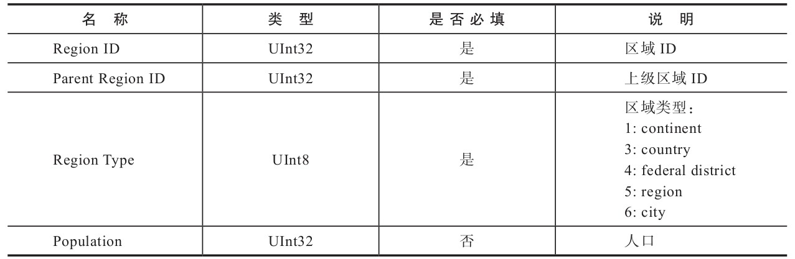

# 内置字典

摘自：《ClickHouse原理解析与应用实践》 — 朱凯

在豆瓣阅读书店查看：<https://read.douban.com/ebook/149635956/?dcs=bookshelf>

本作品由华章数媒授权豆瓣阅读中国大陆范围内电子版制作与发行。

© 版权所有，侵权必究。

-----

ClickHouse目前只有一种内置字典——Yandex.Metrica字典。

从名称上可以看出，这是用在ClickHouse自家产品上的字典，而它的设计意图是快速存取geo地理数据。

但较为遗憾的是，由于版权原因Yandex并没有将geo地理数据开放出来。

这意味着ClickHouse目前的内置字典，只是提供了字典的定义机制和取数函数，而没有内置任何现成的数据。

所以内置字典的现状较为尴尬，需要遵照它的字典规范自行导入数据。

## 内置字典配置说明

内置字典在默认的情况下是禁用状态，需要开启后才能使用。开启它的方式也十分简单，只需将`config.xml`文件中`path_to_regions_hierarchy_file`和`path_to_regions_names_files`两项配置打开。

```xml
<path_to_regions_hierarchy_file>
    /opt/geo/regions_hierarchy.txt
</path_to_regions_hierarchy_file>

<path_to_regions_names_files>
    /opt/geo/
</path_to_regions_names_files>
```

这两项配置是惰性加载的，只有当字典首次被查询的时候才会触发加载动作。填充Yandex.Metrica字典的geo地理数据由两组模型组成，可以分别理解为地区数据的主表及维度表。这两组模型的数据分别由上述两项配置指定，现在依次介绍它们的具体用法。

1. **path_to_regions_hierarchy_file**

    `path_to_regions_hierarchy_file`等同于区域数据的主表，由1个`regions_hierarchy.txt`和多个`regions_hierarchy_[name].txt`区域层次的数据文件共同组成，缺一不可。其中`[name]`表示区域标识符，与`i18n`类似。这些TXT文件内的数据需要使用`TabSeparated`格式定义，其数据模型的格式如表所示。

    

2. **path_to_regions_names_files**

    `path_to_regions_names_files`等同于区域数据的维度表，记录了与区域ID对应的区域名称。维度数据使用6个`regions_names_[name].txt`文件保存，其中`[name]`表示区域标识符与`regions_hierarchy_[name].txt`对应，目前包括`ru`、`en`、`ua`、`by`、`kz`和`tr`。上述这些区域的数据文件必须全部定义，这是因为内置字典在初次加载时，会一次性加载上述6个区域标识的数据文件。如果缺少任何一个文件就会抛出异常并导致初始化失败。

    这些TXT文件内的数据同样需要使用TabSeparated格式定义，其数据模型的格式如表所示。

    

## 使用内置字典

在知晓了内置字典的开启方式和`Yandex.Metrica`字典的数据模型之后，就可以配置字典的数据并使用它们了。首先，在`/opt`路径下新建geo目录：

```shell
# mkdir /opt/geo
```

接着，进入本书附带的演示代码，找到数据字典目录。为了便于读者测试，事先已经准备好了一份测试数据，将下列用于测试的数据文件复制到刚才已经建好的`/opt/geo`目录下：

```shell
# pwd
/opt/geo
# ll
total 36
-rw-r--r--. 1 root root 3096 Jul  7 20:38 regions_hierarchy_ru.txt
-rw-r--r--. 1 root root 3096 Jul  7 20:38 regions_hierarchy.txt
-rw-r--r--. 1 root root 3957 Jul  7 19:44 regions_names_ar.txt
-rw-r--r--. 1 root root 3957 Jul  7 19:44 regions_names_by.txt
-rw-r--r--. 1 root root 3957 Jul  7 19:44 regions_names_en.txt
-rw-r--r--. 1 root root 3957 Jul  7 19:44 regions_names_kz.txt
-rw-r--r--. 1 root root 3957 Jul  7 19:44 regions_names_ru.txt
-rw-r--r--. 1 root root 3957 Jul  7 19:44 regions_names_tr.txt
-rw-r--r--. 1 root root 3957 Jul  7 19:44 regions_names_ua.txt
```

最后，找到config.xml并按照5.1.1节介绍的方法开启内置字典。

至此，内置字典就已经全部设置好了，执行下面的语句就能够访问字典中的数据：

```sql
SELECT regionToName(toUInt32(20009))

┌─regionToName(toUInt32(20009))───┐
│  Buenos Aires Province          │
└─────────────────────────────────┘
```

可以看到，对于Yandex.Metrica字典数据的访问，这里用到了`regionToName`函数。类似这样的函数还有很多，在ClickHouse中它们被称为Yandex.Metrica函数。关于这套函数的更多用法，请参阅官方手册。
