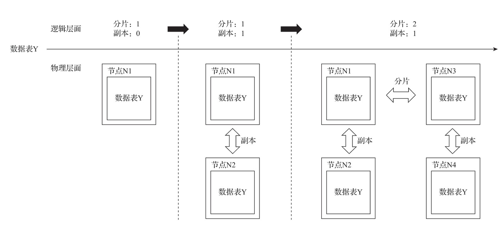
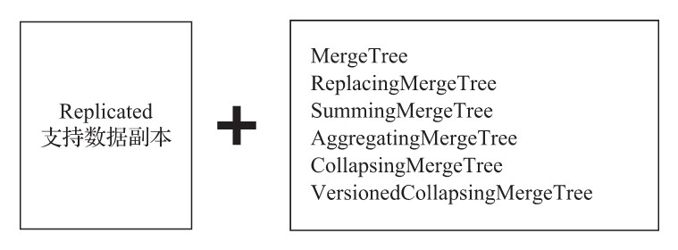
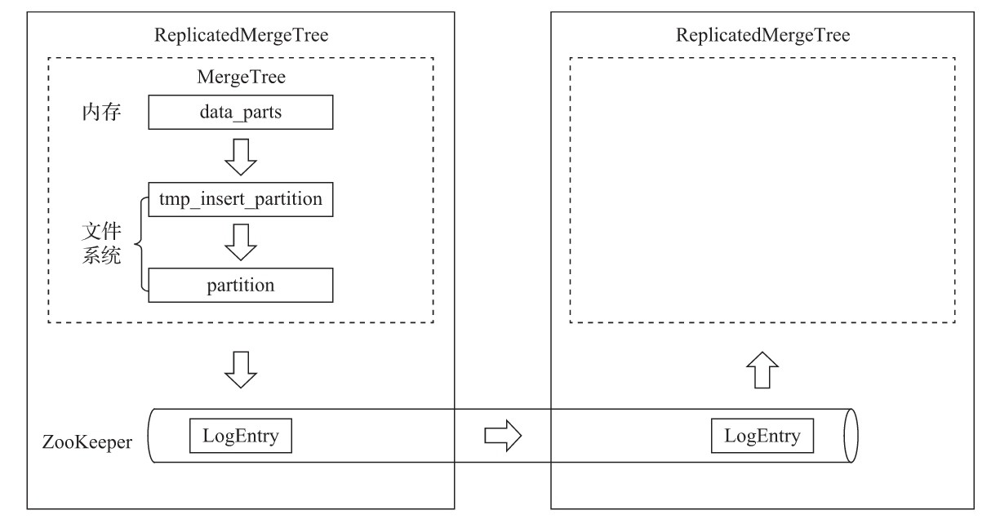

- [数据副本](#数据副本)
  - [副本的特点](#副本的特点)
  - [zookeeper的配置方式](#zookeeper的配置方式)
  - [副本的定义形式](#副本的定义形式)

# 数据副本

在 `*MergeTree` 的前面增加`Replicated`的前缀，则能够组合成一个新的变种引擎，即`Replicated-MergeTree`复制表，如图所示。





只有使用了`ReplicatedMergeTree`复制表系列引擎，才能应用副本的能力。或者用一种更为直接的方式理解，即使用`ReplicatedMergeTree`的数据表就是副本。

`ReplicatedMergeTree`是`MergeTree`的派生引擎，它在`MergeTree`的基础上加入了分布式协同的能力，如图所示:



在MergeTree中，一个数据分区由开始创建到全部完成，会历经两类存储区域。

（1）**内存**：数据首先会被写入内存缓冲区。
（2）**本地磁盘**：数据接着会被写入tmp临时目录分区，待全部完成后再将临时目录重命名为正式分区。

`ReplicatedMergeTree`在上述基础之上增加了`ZooKeeper`的部分，它会进一步在`ZooKeeper`内创建一系列的监听节点，并以此实现多个实例之间的通信。在整个通信过程中，`ZooKeeper`并不会涉及表数据的传输。

## 副本的特点

作为数据副本的主要实现载体，`ReplicatedMergeTree`在设计上有一些显著特点。

- **依赖ZooKeeper**：在执行`INSERT`和`ALTER`查询的时候，`ReplicatedMergeTree`需要借助`ZooKeeper`的分布式协同能力，以实现多个副本之间的同步。但是在查询副本的时候，并不需要使用`ZooKeeper`。

- **表级别的副本**：副本是在表级别定义的，所以每张表的副本配置都可以按照它的实际需求进行个性化定义，包括副本的数量，以及副本在集群内的分布位置等。

- **多主架构**（Multi Master）：**可以在任意一个副本上执行INSERT和ALTER查询，它们的效果是相同的**。这些操作会借助`ZooKeeper`的协同能力被分发至每个副本以本地形式执行。

- **Block数据块**：在执行`INSERT`命令写入数据时，会依据`max_insert_block_size`的大小（默认`1048576`行）将数据切分成若干个`Block`数据块。所以`Block`数据块是数据写入的基本单元，并且具有写入的原子性和唯一性。

- **原子性**：在数据写入时，一个`Block`块内的数据要么全部写入成功，要么全部失败。

- **唯一性**：在写入一个`Block`数据块的时候，会按照当前`Block`数据块的数据顺序、数据行和数据大小等指标，计算Hash信息摘要并记录在案。在此之后，如果某个待写入的`Block`数据块与先前已被写入的`Block`数据块拥有相同的Hash摘要（`Block`数据块内数据顺序、数据大小和数据行均相同），则该`Block`数据块会被忽略。这项设计可以预防由异常原因引起的`Block`数据块重复写入的问题。

## zookeeper的配置方式

在正式开始之前，还需要安装并配置ZooKeeper，因为ReplicatedMergeTree必须对接到它才能工作。

关于ZooKeeper的安装，参考官方文档，使用3.4.5及以上版本均可。

这里着重讲解如何在ClickHouse中增加ZooKeeper的配置。

ClickHouse使用一组zookeeper标签定义相关配置，默认情况下，在全局配置`config.xml`中定义即可。但是各个副本所使用的`Zookeeper`配置通常是相同的，为了便于在多个节点之间复制配置文件，更常见的做法是将这一部分配置抽离出来，独立使用一个文件保存。

首先，在服务器的`/etc/clickhouse-server/config.d`目录下创建一个名为`metrika.xml`的配置文件：

```xml
<?xml version="1.0"?>
<yandex>
  <zookeeper-servers> <!—ZooKeeper配置, 名称自定义 -->
    <node index="1"> <!—节点配置, 可以配置多个地址-->
      <host>hdp1.nauu.com</host>
      <port>2181</port>
    </node>
  </zookeeper-servers>
</yandex>
```

接着，在全局配置`config.xml`中使用`<include_from>`标签导入刚才定义的配置：

```xml
<include_from>/etc/clickhouse-server/config.d/metrika.xml</include_from>
```

并引用ZooKeeper配置的定义：

```xml
<zookeeper incl="zookeeper-servers" optional="false" />
```

其中，incl与metrika.xml配置文件内的节点名称要彼此对应。至此，整个配置过程就完成了。

ClickHouse在它的系统表中，颇为贴心地提供了一张名为`zookeeper`的代理表。通过这张表，可以使用SQL查询的方式读取远端`ZooKeeper`内的数据。有一点需要注意，在用于查询的SQL语句中，必须指定`path`条件，例如查询根路径：

```sql
SELECT * FROM system.zookeeper where path = '/'

┌─name────────────────┬───value─┬──czxid─┐
│ dolphinscheduler    │         │  2627  │
│ clickhouse          │         │ 92875  │
└─────────────────────┴─────────┴────────┘
```

进一步查询clickhouse目录：

```sql
SELECT name, value, czxid, mzxid FROM system.zookeeper where path = '/clickhouse'

┌─────name─────┬───value─┬──czxid──┬───mzxid──┐
│ tables       │         │ 134107  │ 134107   │
│ task_queue   │         │  92876  │  92876   │
└──────────────┴─────────┴─────────┴──────────┘
```

## 副本的定义形式

使用副本的好处甚多。**首先，由于增加了数据的冗余存储，所以降低了数据丢失的风险；其次，由于副本采用了多主架构，所以每个副本实例都可以作为数据读、写的入口，这无疑分摊了节点的负载。**

在使用副本时，不需要依赖任何集群配置, `ReplicatedMergeTree`结合`ZooKeeper`就能完成全部工作。

`ReplicatedMergeTree`的定义方式如下：

```sql
ENGINE = ReplicatedMergeTree('zk_path', 'replica_name')
```

**zk_path**

- 用于指定在`ZooKeeper`中创建的数据表的路径，路径名称是自定义的，并没有固定规则，用户可以设置成自己希望的任何路径。即便如此，ClickHouse还是提供了一些约定俗成的配置模板以供参考，例如：

    ```sql
    /clickhouse/tables/{shard}/table_name
    ```

    其中：

  - `/clickhouse/tables/`是约定俗成的路径固定前缀，表示存放数据表的根路径。
  - `{shard}`表示分片编号，通常用数值替代，例如01、02、03。一张数据表可以有多个分片，而每个分片都拥有自己的副本。
  - `table_name`表示数据表的名称，为了方便维护，通常与物理表的名字相同（虽然ClickHouse并不强制要求路径中的表名称和物理表名相同）；

**replica_name**

- 作用是定义在`ZooKeeper`中创建的副本名称，该名称是区分不同副本实例的唯一标识。一种约定俗成的命名方式是使用所在服务器的域名称。

对于`zk_path`而言，同一张数据表的同一个分片的不同副本，应该定义相同的路径；

而对于`replica_name`而言，同一张数据表的同一个分片的不同副本，应该定义不同的名称。

是不是有些绕口呢？下面列举几个示例。

1个分片、1个副本的情形：

```sql
-- 1分片, 1副本. zk_path相同, replica_name不同
ReplicatedMergeTree('/clickhouse/tables/01/test_1', 'ch5.nauu.com')
ReplicatedMergeTree('/clickhouse/tables/01/test_1', 'ch6.nauu.com')
```

多个分片、1个副本的情形：

```sql
-- 分片1
-- 2分片, 1副本. zk_path相同, 其中{shard}=01, replica_name不同
ReplicatedMergeTree('/clickhouse/tables/01/test_1', 'ch5.nauu.com')
ReplicatedMergeTree('/clickhouse/tables/01/test_1', 'ch6.nauu.com')

-- 分片2
-- 2分片, 1副本. zk_path相同, 其中{shard}=02, replica_name不同
ReplicatedMergeTree('/clickhouse/tables/02/test_1', 'ch7.nauu.com')
ReplicatedMergeTree('/clickhouse/tables/02/test_1', 'ch8.nauu.com')
```
