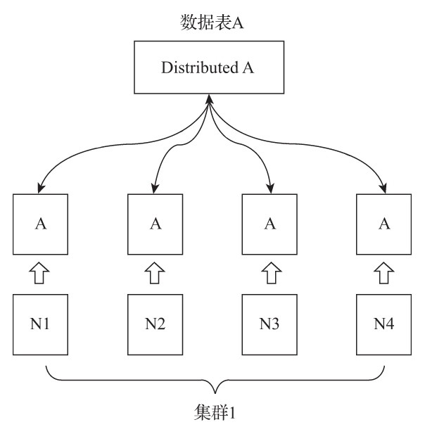
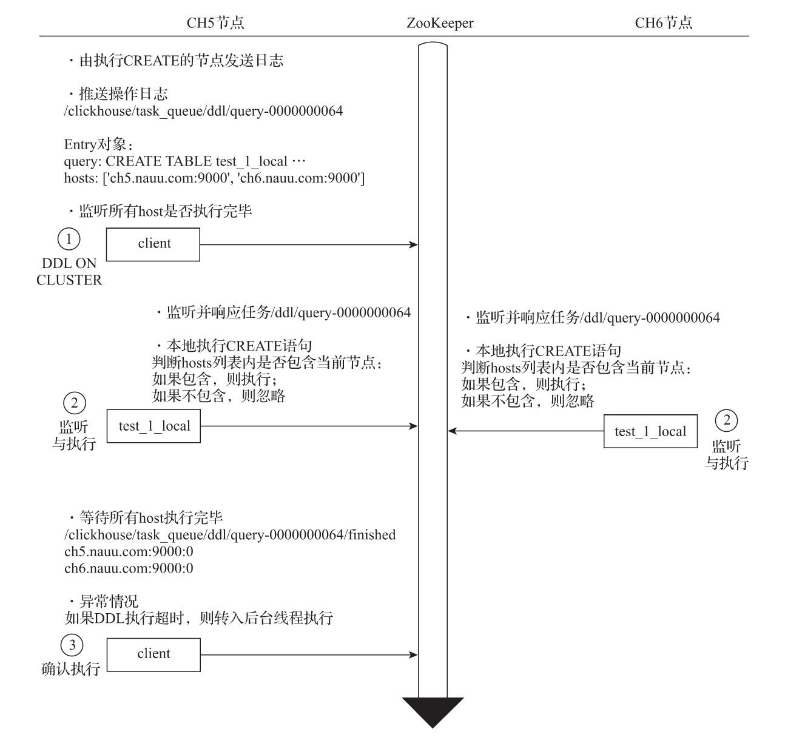

- [数据分片](#数据分片)
  - [1. 集群的配置方式](#1-集群的配置方式)
    - [1.1 不包含副本的分片](#11-不包含副本的分片)
    - [1.2 自定义分片与副本](#12-自定义分片与副本)
  - [2. 基于集群实现分布式DDL](#2-基于集群实现分布式ddl)
    - [2.1 数据结构](#21-数据结构)
    - [2.2 分布式DDL的核心执行流程](#22-分布式ddl的核心执行流程)

# 数据分片

通过引入数据副本，虽然能够有效降低数据的丢失风险（多份存储），并提升查询的性能（分摊查询、读写分离），但是仍然有一个问题没有解决，那就是数据表的容量问题。到目前为止，每个副本自身，仍然保存了数据表的全量数据。所以在业务量十分庞大的场景中，依靠副本并不能解决单表的性能瓶颈。想要从根本上解决这类问题，需要借助另外一种手段，即进一步将数据水平切分，也就是数据分片。

ClickHouse中的每个服务节点都可称为一个shard（分片）。从理论上来讲，假设有N(N>=1)张数据表A，分布在N个ClickHouse服务节点，而这些数据表彼此之间没有重复数据，那么就可以说数据表A拥有N个分片。然而在工程实践中，如果只有这些分片表，那么整个Sharding（分片）方案基本是不可用的。对于一个完整的方案来说，还需要考虑数据在写入时，如何被均匀地写至各个shard，以及数据在查询时，如何路由到每个shard，并组合成结果集。所以，ClickHouse的数据分片需要结合Distributed表引擎一同使用，如图所示。



Distributed表引擎自身不存储任何数据，它能够作为分布式表的一层透明代理，在集群内部自动开展数据的写入、分发、查询、路由等工作。

## 1. 集群的配置方式

在ClickHouse中，集群配置用shard代表分片、用replica代表副本。那么在逻辑层面，表示1分片、0副本语义的配置如下所示：

```xml
<shard> <!-- 分片 -->
  <replica> <!-- 副本 -->
  </replica>
</shard>
```

而表示1分片、1副本语义的配置则是：

```xml
<shard> <!-- 分片 -->
  <replica><!—副本 -->
  </replica>
  <replica>
  </replica>
</shard>
```

可以看到，这样的配置似乎有些反直觉，shard更像是逻辑层面的分组，而无论是副本还是分片，它们的载体都是replica，所以从某种角度来看，副本也是分片。关于这方面的详细介绍会在后续展开，现在先回到之前的话题。

由于`Distributed`表引擎需要读取集群的信息，所以首先必须为ClickHouse添加集群的配置。找到前面在介绍ZooKeeper配置时增加的`metrika.xml`配置文件，将其加入集群的配置信息。

集群有两种配置形式:

### 1.1 不包含副本的分片

如果直接使用node标签定义分片节点，那么该集群将只包含分片，不包含副本。以下面的配置为例：

```xml
<yandex>
  <!--自定义配置名, 与config.xml配置的incl属性对应即可 -->
  <clickhouse_remote_servers>
    <shard_2><!--自定义集群名称-->
      <node><!--定义ClickHouse节点-->
        <host>ch5.nauu.com</host>
        <port>9000</port>
        <!--选填参数
            <weight>1</weight>
            <user></user>
            <password></password>
            <secure></secure>
            <compression></compression>
        -->
      </node>
      <node>
        <host>ch6.nauu.com</host>
        <port>9000</port>
      </node>
    </shard_2>
    ……
  </clickhouse_remote_servers>
```

该配置定义了一个名为shard_2的集群，其包含了2个分片节点，它们分别指向了CH5和CH6服务器。现在分别对配置项进行说明：

- **shard_2**: 表示自定义的集群名称，全局唯一，是后续引用集群配置的唯一标识。在一个配置文件内，可以定义任意组集群。
- **node**: 用于定义分片节点，不包含副本。
- **host**: 指定部署了ClickHouse节点的服务器地址。
- **port**: 指定ClickHouse服务的TCP端口。

接下来介绍选填参数：

- **weight**: 分片权重默认为1，在后续小节中会对其详细介绍。
- **user**: 为ClickHouse用户，默认为default。
- **password**: 为ClickHouse的用户密码，默认为空字符串。
- **secure**: 为SSL连接的端口，默认为9440。
- **compression**: 表示是否开启数据压缩功能，默认为true.

### 1.2 自定义分片与副本

集群配置支持自定义分片和副本的数量，这种形式需要使用shard标签代替先前的node，除此之外的配置完全相同。在这种自定义配置的方式下，分片和副本的数量完全交由配置者掌控。其中，shard表示逻辑上的数据分片，而物理上的分片则用replica表示。如果在1个shard标签下定义N(N>=1)组replica，则该shard的语义表示1个分片和N-1个副本。接下来用几组配置示例进行说明。

- 1）不包含副本的分片

  下面所示的这组集群配置的效果与先前介绍的shard_2集群相同：

  ```xml
  <!-- 2个分片、0个副本 -->
  <sharding_simple> <!-- 自定义集群名称 -->
    <shard> <!-- 分片 -->
      <replica> <!-- 副本 -->
        <host>ch5.nauu.com</host>
        <port>9000</port>
      </replica>
    </shard>
    <shard>
      <replica>
        <host>ch6.nauu.com</host>
        <port>9000</port>
      </replica>
    </shard>
  </sharding_simple>
  ```

  sharding_simple集群的语义为2分片、0副本（1分片、0副本，再加上1分片、0副本）。

- 2）N个分片和N个副本

  这种形式可以按照实际需求自由组合，例如下面的这组配置，集群sharding_simple_1拥有1个分片和1个副本：

  ```xml
  <!-- 1个分片 1个副本-->
  <sharding_simple_1>
    <shard>
      <replica>
        <host>ch5.nauu.com</host>
        <port>9000</port>
      </replica>
      <replica>
        <host>ch6.nauu.com</host>
        <port>9000</port>
      </replica>
    </shard>
  </sharding_simple_1>
  ```

  从上面的配置信息中能够得出结论，集群中replica数量的上限是由ClickHouse节点的数量决定的，例如为了部署集群sharding_ha，需要4个ClickHouse服务节点作为支撑。

  在完成上述配置之后，可以查询系统表验证集群配置是否已被加载：

  ```sql
  :) SELECT cluster, host_name FROM system.clusters

  ┌─cluster──────────────┬──host_name────┐
  │ shard_2              │ ch5.nauu.com  │
  │ shard_2              │ ch6.nauu.com  │
  │ sharding_simple      │ ch5.nauu.com  │
  │ sharding_simple      │ ch6.nauu.com  │
  │ sharding_simple_1    │ ch5.nauu.com  │
  │ sharding_simple_1    │ ch6.nauu.com  │
  └──────────────────────┴───────────────┘
  ```

## 2. 基于集群实现分布式DDL

默认的情况下，`CREATE`、`DROP`、`RENAME`和`ALTER`等`DDL语句`并不支持分布式执行。而在加入集群配置后，就可以使用新的语法实现分布式DDL执行了，其语法形式如下：

```sql
CREATE/DROP/RENAME/ALTER TABLE  ON CLUSTER cluster_name
```

其中，cluster_name对应了配置文件中的集群名称，ClickHouse会根据集群的配置信息顺藤摸瓜，分别去各个节点执行DDL语句。

下面是在10.2.3节中使用的多副本示例：

```sql
-- 1分片, 2副本. zk_path相同, replica_name不同。
ReplicatedMergeTree('/clickhouse/tables/01/test_1, 'ch5.nauu.com')
ReplicatedMergeTree('/clickhouse/tables/01/test_1, 'ch6.nauu.com')
```

现在将它改写为分布式DDL的形式：

```sql
CREATE TABLE test_1_local ON CLUSTER shard_2(
  id UInt64
  --这里可以使用任意其他表引擎, 
)ENGINE = ReplicatedMergeTree('/clickhouse/tables/{shard}/test_1', '{replica}')
ORDER BY id

┌─host───────────┬─port──┬─status───┬─error──┬─num_hosts_active──┐
│ ch6.nauu.com   │ 9000  │      0   │        │               0   │
│ ch5.nauu.com   │ 9000  │      0   │        │               0   │
└────────────────┴───────┴──────────┴────────┴───────────────────┘
```

在执行了上述语句之后，ClickHouse会根据集群shard_2的配置信息，分别在CH5和CH6节点本地创建test_1_local。

如果要删除test_1_local，则执行下面的分布式DROP：

```sql
DROP TABLE test_1_local ON CLUSTER shard_2

┌─host───────────┬─port──┬─status───┬─error──┬─num_hosts_active──┐
│ ch6.nauu.com   │ 9000  │      0   │        │               0   │
│ ch5.nauu.com   │ 9000  │      0   │        │               0   │
└────────────────┴───────┴──────────┴────────┴───────────────────┘
```

值得注意的是，在改写的CREATE语句中，用`{shard}`和`{replica}`两个动态宏变量代替了先前的硬编码方式。执行下面的语句查询系统表，能够看到当前ClickHouse节点中已存在的宏变量：

```sql
--ch5节点
SELECT * FROM system.macros

┌─macro─────┬─substitution──┐
│ replica   │ ch5.nauu.com  │
│ shard     │ 01            │
└───────────┴───────────────┘

--ch6节点
SELECT * FROM remote('ch6.nauu.com:9000', 'system', 'macros', 'default')

┌─macro─────┬─substitution──┐
│ replica   │ ch6.nauu.com  │
│ shard     │ 02            │
└───────────┴───────────────┘
```

这些宏变量是通过配置文件的形式预先定义在各个节点的配置文件中的，配置文件如下所示。

在CH5节点的config.xml配置中预先定义了分区01的宏变量：

```xml
<macros>
  <shard>01</shard>
  <replica>ch5.nauu.com</replica>
</macros>
```

在CH6节点的config.xml配置中预先定义了分区02的宏变量：

```xml
<macros>
  <shard>02</shard>
  <replica>ch6.nauu.com</replica>
</macros>
```

### 2.1 数据结构

与ReplicatedMergeTree类似，分布式DDL语句在执行的过程中也需要借助ZooKeeper的协同能力，以实现日志分发。

- 1）ZooKeeper内的节点结构

  在默认情况下，分布式DDL在ZooKeeper内使用的根路径为：

  ```shell
  /clickhouse/task_queue/ddl
  ```

  该路径由config.xml内的distributed_ddl配置指定：

  ```xml
  <distributed_ddl>
    <!-- Path in ZooKeeper to queue with DDL queries -->
    <path>/clickhouse/task_queue/ddl</path>
  </distributed_ddl>
  ```

  在此根路径之下，还有一些其他的监听节点，其中包括/query-[seq]，其是DDL操作日志，每执行一次分布式DDL查询，在该节点下就会新增一条操作日志，以记录相应的操作指令。当各个节点监听到有新日志加入的时候，便会响应执行。DDL操作日志使用ZooKeeper的持久顺序型节点，每条指令的名称以query-为前缀，后面的序号递增，例如query-0000000000、query-0000000001等。在每条query-[seq]操作日志之下，还有两个状态节点：

  - （1）/query-[seq]/active：用于状态监控等用途，在任务的执行过程中，在该节点下会临时保存当前集群内状态为active的节点。
  - （2）/query-[seq]/finished：用于检查任务完成情况，在任务的执行过程中，每当集群内的某个host节点执行完毕之后，便会在该节点下写入记录。例如下面的语句。

  ```sql
  /query-000000001/finished
  ch5.nauu.com:9000 : 0
  ch6.nauu.com:9000 : 0
  ```

  上述语句表示集群内的CH5和CH6两个节点已完成任务。

- 2）DDLLogEntry日志对象的数据结构

  在/query-[seq]下记录的日志信息由DDLLogEntry承载，它拥有如下几个核心属性：

  - （1）query记录了DDL查询的执行语句，例如：
  
    ```sql
    query: DROP TABLE default.test_1_local ON CLUSTER shard_2
    ```

  - （2）hosts记录了指定集群的hosts主机列表，集群由分布式DDL语句中的ON CLUSTER指定，例如：

    ```sql
    hosts: ['ch5.nauu.com:9000','ch6.nauu.com:9000']
    ```

    在分布式DDL的执行过程中，会根据hosts列表逐个判断它们的执行状态。

  - （3）initiator记录初始化host主机的名称，hosts主机列表的取值来自于初始化host节点上的集群，例如：

    ```sql
    initiator: ch5.nauu.com:9000
    ```

    hosts主机列表的取值来源等同于下面的查询：

    ```sql
    --从initiator节点查询cluster信息
    SELECT host_name 
    FROM remote('ch5.nauu.com:9000', 'system', 'clusters', 'default')  
    WHERE cluster = 'shard_2'

    ┌─host_name───────┐
    │ ch5.nauu.com    │
    │ ch6.nauu.com    │
    └─────────────────┘
    ```

### 2.2 分布式DDL的核心执行流程

与副本协同的核心流程类似，接下来，就以之前介绍的创建`test_1_local`的过程为例，解释分布式DDL的核心执行流程。整个流程如图所示。



（1）**推送DDL日志**：首先在CH5节点执行CREATE TABLE ON CLUSTER，本着谁执行谁负责的原则，在这个案例中将会由CH5节点负责创建DDLLogEntry日志并将日志推送到ZooKeeper，同时也会由这个节点负责监控任务的执行进度。

（2）**拉取日志并执行**：CH5和CH6两个节点分别监听/ddl/query-0000000064日志的推送，于是它们分别拉取日志到本地。首先，它们会判断各自的host是否被包含在DDLLog-Entry的hosts列表中。如果包含在内，则进入执行流程，执行完毕后将状态写入finished节点；如果不包含，则忽略这次日志的推送。

（3）**确认执行进度**：在步骤1执行DDL语句之后，客户端会阻塞等待180秒，以期望所有host执行完毕。如果等待时间大于180秒，则会转入后台线程继续等待（等待时间由distributed_ddl_task_timeout参数指定，默认为180秒）。
