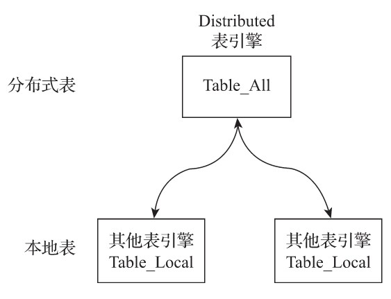
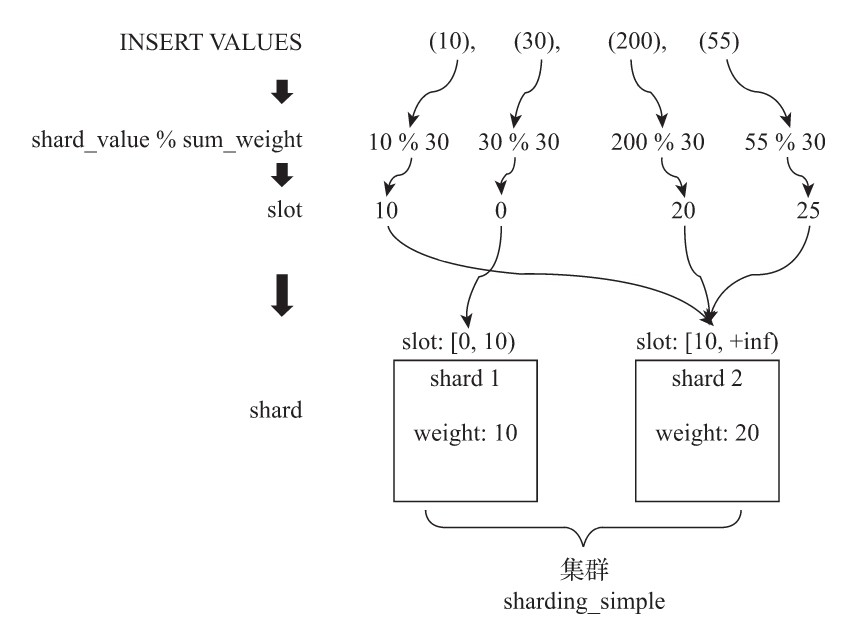
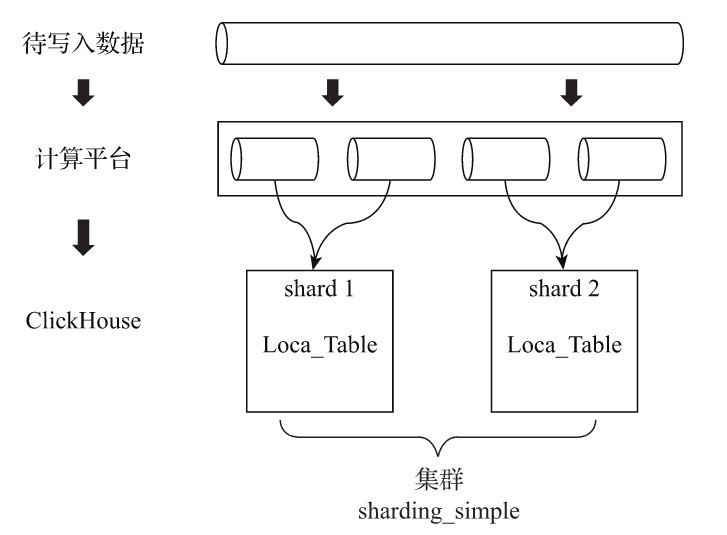
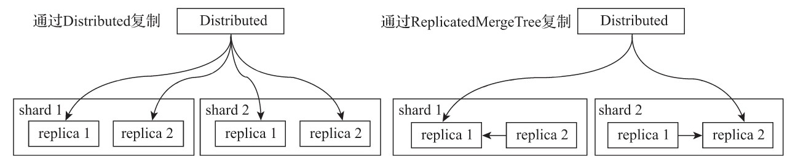
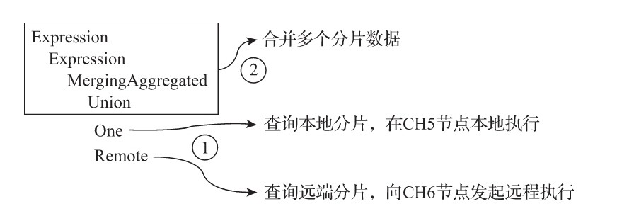
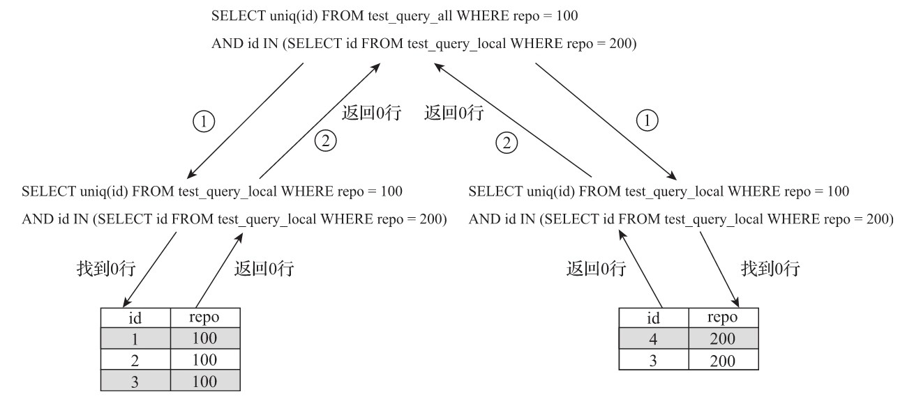
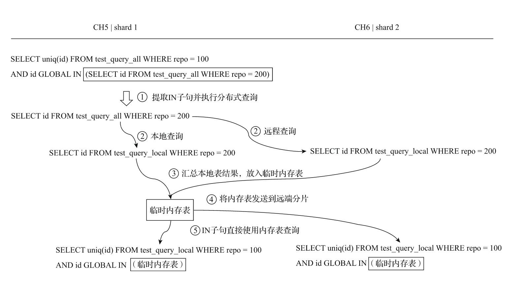

- [Distributed原理解析](#distributed原理解析)
  - [1. 定义形式](#1-定义形式)
  - [2. 查询的分类](#2-查询的分类)
  - [3. 分片规则](#3-分片规则)
    - [3.1 分片权重](#31-分片权重)
    - [3.2 slot（槽）](#32-slot槽)
    - [3.3 选择函数](#33-选择函数)
  - [4. 分布式写入的核心流程](#4-分布式写入的核心流程)
    - [4.1 将数据写入分片的核心流程](#41-将数据写入分片的核心流程)
    - [4.2 副本复制数据的核心流程](#42-副本复制数据的核心流程)
  - [5. 分布式查询的核心流程](#5-分布式查询的核心流程)
    - [5.1 多副本的路由规则](#51-多副本的路由规则)
    - [5.2 多分片查询的核心流程](#52-多分片查询的核心流程)
    - [5.3 使用Global优化分布式子查询](#53-使用global优化分布式子查询)

# Distributed原理解析

Distributed表引擎是分布式表的代名词，它自身不存储任何数据，而是作为数据分片的透明代理，能够自动路由数据至集群中的各个节点，所以Distributed表引擎需要和其他数据表引擎一起协同工作. 如图所示：



从实体表层面来看，一张分片表由两部分组成：

- **本地表**：通常以`_local`为后缀进行命名。本地表是承接数据的载体，可以使用非`Distributed`的任意表引擎，一张本地表对应了一个数据分片。

- **分布式表**：通常以`_all`为后缀进行命名。分布式表只能使用`Distributed`表引擎，它与本地表形成一对多的映射关系，日后将通过分布式表代理操作多张本地表。

对于分布式表与本地表之间表结构的一致性检查，Distributed表引擎采用了读时检查的机制，这意味着如果它们的表结构不兼容，只有在查询时才会抛出错误，而在创建表时并不会进行检查。不同ClickHouse节点上的本地表之间，使用不同的表引擎也是可行的，但是通常不建议这么做，保持它们的结构一致，有利于后期的维护并避免造成不可预计的错误。

## 1. 定义形式

Distributed表引擎的定义形式如下所示：

```sql
ENGINE = Distributed(cluster, database, table [,sharding_key])
```

其中，各个参数的含义分别如下：

- **cluster**：集群名称，与集群配置中的自定义名称相对应。在对分布式表执行写入和查询的过程中，它会使用集群的配置信息来找到相应的host节点。
- **database和table**：分别对应数据库和表的名称，分布式表使用这组配置映射到本地表。
- **sharding_key**：分片键，选填参数。在数据写入的过程中，分布式表会依据分片键的规则，将数据分布到各个host节点的本地表。

现在用示例说明Distributed表的声明方式，建表语句如下所示：

```sql
CREATE TABLE test_shard_2_all ON CLUSTER sharding_simple (
  id UInt64
)ENGINE = Distributed(sharding_simple, default, test_shard_2_local,rand())
```

上述表引擎参数的语义可以理解为，代理的本地表为default.test_shard_2_local，它们分布在集群sharding_simple的各个shard，在数据写入时会根据rand()随机函数的取值决定数据写入哪个分片。值得注意的是，此时此刻本地表还未创建，所以从这里也能看出，Distributed表运用的是读时检查的机制，对创建分布式表和本地表的顺序并没有强制要求。同样值得注意的是，在上面的语句中使用了ON CLUSTER分布式DDL，这意味着在集群的每个分片节点上，都会创建一张Distributed表，如此一来便可以从其中任意一端发起对所有分片的读、写请求，如图所示。


接着需要创建本地表，一张本地表代表着一个数据分片。这里同样可以利用先前已经配置好的集群配置，使用分布式DDL语句迅速的在各个节点创建相应的本地表：

```sql
CREATE TABLE test_shard_2_local ON CLUSTER sharding_simple (
    id UInt64
) ENGINE = MergeTree()
ORDER BY id
PARTITION BY id
```

至此，拥有两个数据分片的分布式表test_shard_2就建好了。

## 2. 查询的分类

Distributed表的查询操作可以分为如下几类：

- **会作用于本地表的查询**：对于`INSERT`和`SELECT`查询，`Distributed`将会以分布式的方式作用于`local本地表`。而对于这些查询的具体执行逻辑，将会在后续小节介绍。

- **只会影响Distributed自身，不会作用于本地表的查询**：`Distributed`支持部分元数据操作，包括`CREATE`、`DROP`、`RENAME`和`ALTER`，其中`ALTER`并不包括分区的操作（`ATTACH PARTITION`、`REPLACE PARTITION`等）。这些查询只会修改`Distributed`表自身，并不会修改`local`本地表。例如要彻底删除一张分布式表，则需要分别删除分布式表和本地表，示例如下。

    ```sql
    --删除分布式表
    DROP TABLE test_shard_2_all ON CLUSTER sharding_simple

    --删除本地表
    DROP TABLE test_shard_2_local ON CLUSTER sharding_simple
    ```

- **不支持的查询**：Distributed表不支持任何MUTATION类型的操作，包括`ALTER DELETE`和`ALTER UPDATE`。

## 3. 分片规则

关于分片的规则这里将做进一步的展开说明。分片键要求返回一个整型类型的取值，包括Int系列和UInt系列。例如分片键可以是一个具体的整型列字段：

```sql
-- 按照用户id的余数划分
Distributed(cluster, database, table ,userid)
```

也可以是一个返回整型的表达式：

```sql
--按照随机数划分
Distributed(cluster, database, table ,rand())

--按照用户id的散列值划分
Distributed(cluster, database, table , intHash64(userid))
```

如果不声明分片键，那么分布式表只能包含一个分片，这意味着只能映射一张本地表，否则，在写入数据时将会得到如下异常：

```log
Method write is not supported by storage Distributed with more than one shard and no sharding key provided
```

如果一张分布式表只包含一个分片，那就意味着其失去了使用的意义了。所以虽然分片键是选填参数，但是通常都会按照业务规则进行设置。
那么数据具体是如何被划分的呢？想要讲清楚这部分逻辑，首先需要明确几个概念。

### 3.1 分片权重

在集群的配置中，有一项weight（分片权重）的设置：

```xml
<sharding_simple><!-- 自定义集群名称 -->
  <shard><!-- 分片 -->
    <weight>10</weight><!-- 分片权重 -->
    ……
  </shard>
  <shard>
    <weight>20</weight>
    ……
  </shard>
  …
```

weight默认为1，虽然可以将它设置成任意整数，但官方建议应该尽可能设置成较小的值。分片权重会影响数据在分片中的倾斜程度，一个分片权重值越大，那么它被写入的数据就会越多。

### 3.2 slot（槽）

slot可以理解成许多小的水槽，如果把数据比作是水的话，那么数据之水会顺着这些水槽流进每个数据分片。slot的数量等于所有分片的权重之和，假设集群sharding_simple有两个Shard分片，第一个分片的weight为10，第二个分片的weight为20，那么slot的数量则等于30。slot按照权重元素的取值区间，与对应的分片形成映射关系。在这个示例中，如果slot值落在\[0,10)区间，则对应第一个分片；如果slot值落在\[10,20\]区间，则对应第二个分片。

### 3.3 选择函数

选择函数用于判断一行待写入的数据应该被写入哪个分片，整个判断过程大致分成两个步骤：

（1）它会找出slot的取值，其计算公式如下：

```python
slot = shard_value % sum_weight
```

其中，shard_value是分片键的取值；sum_weight是所有分片的权重之和；slot等于shard_value和sum_weight的余数。假设某一行数据的shard_value是10，sum_weight是30（两个分片，第一个分片权重为10，第二个分片权重为20），那么slot值等于10（10%30=10）。

（2）基于slot值找到对应的数据分片。当slot值等于10的时候，它属于[10,20)区间，所以这行数据会对应到第二个Shard分片。
整个过程的示意如图所示。



## 4. 分布式写入的核心流程

在向集群内的分片写入数据时，通常有两种思路：一种是借助外部计算系统，事先将数据均匀分片，再借由计算系统直接将数据写入ClickHouse集群的各个本地表，如图所示。



上述这种方案通常拥有更好的写入性能，因为分片数据是被并行点对点写入的。但是这种方案的实现主要依赖于外部系统，而不在于ClickHouse自身，所以这里主要会介绍第二种思路。

第二种思路是通过Distributed表引擎代理写入分片数据的，接下来开始介绍数据写入的核心流程。
为了便于理解整个过程，这里会将分片写入、副本复制拆分成两个部分进行讲解。在讲解过程中，会使用两个特殊的集群分别进行演示：第一个集群拥有2个分片和0个副本，通过这个示例向大家讲解分片写入的核心流程；第二个集群拥有1个分片和1个副本，通过这个示例向大家讲解副本复制的核心流程。

### 4.1 将数据写入分片的核心流程

在对Distributed表执行INSERT查询的时候，会进入数据写入分片的执行逻辑，它的核心流程如图所示。

![写入多个分片]](../images/clickhouse16.jpeg)

在这个流程中，继续使用集群sharding_simple的示例，该集群由2个分片和0个副本组成。整个流程从上至下按照时间顺序进行，其大致分成5个步骤。现在根据图片所示编号讲解整个过程。

- 1）在第一个分片节点写入本地分片数据

  首先在CH5节点，对分布式表test_shard_2_all执行INSERT查询，尝试写入10、30、200和55四行数据。执行之后分布式表主要会做两件事情：第一，根据分片规则划分数据，在这个示例中，30会归至分片1，而10、200和55则会归至分片2；第二，将属于当前分片的数据直接写入本地表test_shard_2_local。

- 2）第一个分片建立远端连接，准备发送远端分片数据

  将归至远端分片的数据以分区为单位，分别写入test_shard_2_all存储目录下的临时bin文件，数据文件的命名规则如下：

  ```sql
  /database@host:port/[increase_num].bin
  ```

  由于在这个示例中只有一个远端分片CH6，所以它的临时数据文件如下所示：

  ```sql
  /test_shard_2_all/default@ch6.nauu.com:9000/1.bin
  ```

  10、200和55三行数据会被写入上述这个临时数据文件。接着，会尝试与远端CH6分片建立连接：

  ```sql
  Connection (ch6.nauu.com:9000): Connected to ClickHouse server
  ```

- 3）第一个分片向远端分片发送数据

  此时，会有另一组监听任务负责监听/test_shard_2_all目录下的文件变化，这些任务负责将目录数据发送至远端分片：

  ```sql
  test_shard_2_all.Distributed.DirectoryMonitor:
  Started processing /test_shard_2_all/default@ch6.nauu.com:9000/1.bin
  ```

  其中，每份目录将会由独立的线程负责发送，数据在传输之前会被压缩。

- 4）第二个分片接收数据并写入本地

  CH6分片节点确认建立与CH5的连接：

  ```sql
  TCPHandlerFactory: TCP Request. Address: CH5:45912
  TCPHandler: Connected ClickHouse server
  ```

  在接收到来自CH5发送的数据后，将它们写入本地表：

  ```sql
  executeQuery: (from CH5) INSERT INTO default.test_shard_2_local

  --第一个分区
  Reserving 1.00 MiB on disk 'default'
  Renaming temporary part tmp_insert_10_1_1_0 to 10_1_1_0.

  --第二个分区
  Reserving 1.00 MiB on disk 'default'
  Renaming temporary part tmp_insert_200_2_2_0 to 200_2_2_0.

  --第三个分区
  Reserving 1.00 MiB on disk 'default'
  Renaming temporary part tmp_insert_55_3_3_0 to 55_3_3_0.
  ```

- 5）由第一个分片确认完成写入

  最后，还是由CH5分片确认所有的数据发送完毕：

  ```sql
  Finished processing /test_shard_2_all/default@ch6.nauu.com:9000/1.bin
  ```
  
  至此，整个流程结束。

可以看到，在整个过程中，Distributed表负责所有分片的写入工作。本着谁执行谁负责的原则，在这个示例中，由CH5节点的分布式表负责切分数据，并向所有其他分片节点发送数据。

在由Distributed表负责向远端分片发送数据时，有异步写和同步写两种模式：如果是异步写，则在Distributed表写完本地分片之后，INSERT查询就会返回成功写入的信息；如果是同步写，则在执行INSERT查询之后，会等待所有分片完成写入。使用何种模式由insert_distributed_sync参数控制，默认为false，即异步写。如果将其设置为true，则可以一进步通过insert_distributed_timeout参数控制同步等待的超时时间。

### 4.2 副本复制数据的核心流程

如果在集群的配置中包含了副本，那么除了刚才的分片写入流程之外，还会触发副本数据的复制流程。数据在多个副本之间，有两种复制实现方式：一种是继续借助Distributed表引擎，由它将数据写入副本；另一种则是借助ReplicatedMergeTree表引擎实现副本数据的分发。两种方式的区别如图所示。



- 1）通过Distributed复制数据

  在这种实现方式下，即使本地表不使用ReplicatedMergeTree表引擎，也能实现数据副本的功能。Distributed会同时负责分片和副本的数据写入工作，而副本数据的写入流程与分片逻辑相同。现在用一个简单示例说明。首先让我们再重温一下集群sharding_simple_1的配置，它的配置如下：

  ```xml
  <!-- 1个分片 1个副本-->
  <sharding_simple_1>
    <shard>
      <replica>
        <host>ch5.nauu.com</host>
        <port>9000</port>
      </replica>
      <replica>
        <host>ch6.nauu.com</host>
        <port>9000</port>
      </replica>
    </shard>
  </sharding_simple_1>
  ```
  
  现在，尝试在这个集群内创建数据表，首先创建本地表：

  ```sql
  CREATE TABLE test_sharding_simple1_local ON CLUSTER sharding_simple_1(
    id UInt64
  )ENGINE = MergeTree()
  ORDER BY id
  ```

  接着创建Distributed分布式表：

  ```sql
  CREATE TABLE test_sharding_simple1_all
  (
    id UInt64
  )ENGINE = Distributed(sharding_simple_1, default, test_sharding_simple1_local,rand())
  ```

  之后，向Distributed表写入数据，它会负责将数据写入集群内的每个replica。

  在这种实现方案下，Distributed节点需要同时负责分片和副本的数据写入工作，它很有可能会成为写入的单点瓶颈，所以就有了接下来将要说明的第二种方案。

- 2）通过ReplicatedMergeTree复制数据

  如果在集群的shard配置中增加internal_replication参数并将其设置为true（默认为false），那么Distributed表在该shard中只会选择一个合适的replica并对其写入数据。此时，如果使用ReplicatedMergeTree作为本地表的引擎，则在该shard内，多个replica副本之间的数据复制会交由ReplicatedMergeTree自己处理，不再由Distributed负责，从而为其减负。

  在shard中选择replica的算法大致如下：首选，在ClickHouse的服务节点中，拥有一个全局计数器errors_count，当服务出现任何异常时，该计数累积加1；接着，当一个shard内拥有多个replica时，选择errors_count错误最少的那个。

  加入internal_replication配置后示例如下所示：

  ```xml
  <shard>
    <!-- 由ReplicatedMergeTree复制表自己负责数据分发 -->
    <internal_replication>true</internal_replication>
    <replica>
        <host>ch5.nauu.com</host>
        <port>9000</port>
    </replica>
    <replica>
        <host>ch6.nauu.com</host>
        <port>9000</port>
    </replica>
  </shard>
  ```

  关于Distributed表引擎如何将数据写入分片，请参见[第 4 节]((#4-分布式写入的核心流程))；而关于Replicated-MergeTree表引擎如何复制分发数据，请参见[第3节](#3-分片规则)。

## 5. 分布式查询的核心流程

与数据写入有所不同，在面向集群查询数据的时候，只能通过Distributed表引擎实现。当Distributed表接收到SELECT查询的时候，它会依次查询每个分片的数据，再合并汇总返回。接下来将对数据查询时的重点逻辑进行介绍。

### 5.1 多副本的路由规则

在查询数据的时候，如果集群中的一个shard，拥有多个replica，那么Distributed表引擎需要面临副本选择的问题。它会使用负载均衡算法从众多replica中选择一个，而具体使用何种负载均衡算法，则由load_balancing参数控制：

```sql
load_balancing = random/nearest_hostname/in_order/first_or_random
```

有如下四种负载均衡算法：

- 1）random

  random是默认的负载均衡算法，正如前文所述，在ClickHouse的服务节点中，拥有一个全局计数器errors_count，当服务发生任何异常时，该计数累积加1。而random算法会选择errors_count错误数量最少的replica，如果多个replica的errors_count计数相同，则在它们之中随机选择一个。

- 2）nearest_hostname

  nearest_hostname可以看作random算法的变种，首先它会选择errors_count错误数量最少的replica，如果多个replica的errors_count计数相同，则选择集群配置中host名称与当前host最相似的一个。而相似的规则是以当前host名称为基准按字节逐位比较，找出不同字节数最少的一个，例如CH5-1-1和CH5-1-2.nauu.com有一个字节不同：

  ```sql
  CH5-1-1
  CH5-1-2.nauu.com
  ```

  而CH5-1-1和CH5-2-2则有两个字节不同：

  ```sql
  CH5-1-1
  CH5-2-2
  ```

- 3）in_order

  in_order同样可以看作random算法的变种，首先它会选择errors_count错误数量最少的replica，如果多个replica的errors_count计数相同，则按照集群配置中replica的定义顺序逐个选择。

- 4）first_or_random
  
  first_or_random可以看作in_order算法的变种，首先它会选择errors_count错误数量最少的replica，如果多个replica的errors_count计数相同，它首先会选择集群配置中第一个定义的replica，如果该replica不可用，则进一步随机选择一个其他的replica。

### 5.2 多分片查询的核心流程

分布式查询与分布式写入类似，同样本着谁执行谁负责的原则，它会由接收SELECT查询的Distributed表，并负责串联起整个过程。首先它会将针对分布式表的SQL语句，按照分片数量将查询拆分成若干个针对本地表的子查询，然后向各个分片发起查询，最后再汇总各个分片的返回结果。如果对分布式表按如下方式发起查询：

```sql
SELECT * FROM distributed_table
```

那么它会将其转为如下形式之后，再发送到远端分片节点来执行：

```sql
SELECT * FROM local_table
```

以sharding_simple集群的test_shard_2_all为例，假设在CH5节点对分布式表发起查询：

```sql
SELECT COUNT(*) FROM test_shard_2_all
```

那么，Distributed表引擎会将查询计划转换为多个分片的UNION联合查询，如图所示。



整个执行计划从下至上大致分成两个步骤：

- 1）查询各个分片数据

  在图所示执行计划中，One和Remote步骤是并行执行的，它们分别负责了本地和远端分片的查询动作。其中，在One步骤会将SQL转换成对本地表的查询：

  ```sql
  SELECT COUNT() FROM default.test_shard_2_local
  ```

  而在Remote步骤中，会建立与CH6节点的连接，并向其发起远程查询：

  ```sql
  Connection (ch6.nauu.com:9000): Connecting. Database: …
  ```

  CH6节点在接收到来自CH5的查询请求后，开始在本地执行。同样，SQL会转换成对本地表的查询：

  ```sql
  executeQuery: (from CH5:45992, initial_query_id: 4831b93b-5ae6-4b18-bac9-e10cc9614353) WITH toUInt32(2) AS _shard_num 
  SELECT COUNT() FROM default.test_shard_2_local
  ```

- 2）合并返回结果

  多个分片数据均查询返回后，按如下方法在CH5节点将它们合并：

  ```sql
  Read 2 blocks of partially aggregated data, total 2 rows.
  Aggregator: Converting aggregated data to blocks
  ……
  ```

### 5.3 使用Global优化分布式子查询

如果在分布式查询中使用子查询，可能会面临两难的局面。下面来看一个示例。假设有这样一张分布式表test_query_all，它拥有两个分片，而表内的数据如下所示：

```sql
-- CH5节点test_query_local
┌─id──┬─repo──┐
│  1  │  100  │
│  2  │  100  │
│  3  │  100  │
└─────┴───────┘

-- CH6节点test_query_local
┌─id──┬─repo──┐
│  3  │  200  │
│  4  │  200  │
└─────┴───────┘
```

其中，id代表用户的编号，repo代表仓库的编号。如果现在有一项查询需求，要求找到同时拥有两个仓库的用户，应该如何实现？对于这类交集查询的需求，可以使用IN子查询，此时你会面临两难的选择：IN查询的子句应该使用本地表还是分布式表？（使用JOIN面临的情形与IN类似）。

- 1）使用本地表的问题

  如果在IN查询中使用本地表，例如下面的语句：

  ```sql
  SELECT uniq(id) FROM test_query_all WHERE repo = 100 
  AND id IN (SELECT id FROM test_query_local WHERE repo = 200)

  ┌─uniq(id)───┐
  │        0   │
  └────────────┘
  ```

  那么你会发现返回的结果是错误的。这是为什么呢？这是因为分布式表在接收到查询之后，会将上述SQL替换成本地表的形式，再发送到每个分片进行执行：

  ```sql
  SELECT uniq(id) FROM test_query_local WHERE repo = 100 
  AND id IN (SELECT id FROM test_query_local WHERE repo = 200)
  ```

  注意，IN查询的子句使用的是本地表：

  ```sql
  SELECT id FROM test_query_local WHERE repo = 200
  ```

  由于在单个分片上只保存了部分的数据，所以该SQL语句没有匹配到任何数据，如图所示。

  

  从上图中可以看到，单独在分片1或分片2内均无法找到repo同时等于100和200的数据。

- 2）使用分布式表的问题

  为了解决返回结果错误的问题，现在尝试在IN查询子句中使用分布式表：

  ```sql
  SELECT uniq(id) 
  FROM test_query_all 
  WHERE repo = 100 AND id IN (
      SELECT id 
      FROM test_query_all 
      WHERE repo = 200
  )

  ┌─uniq(id)───┐
  │        1   │
  └────────────┘
  ```

  这次返回了正确的查询结果。那是否意味着使用这种方案就万无一失了呢？通过进一步观察执行日志会发现，情况并非如此，该查询的请求被放大了两倍。

  这是由于在IN查询子句中，同样也使用了分布式表查询：

  ```sql
  SELECT id FROM test_query_all WHERE repo = 200
  ```

  所以在CH6节点接收到这条SQL之后，它将再次向其他分片发起远程查询，如图所示。

  

  因此可以得出结论，在IN查询子句使用分布式表的时候，查询请求会被放大N的平方倍，其中N等于集群内分片节点的数量，假如集群内有10个分片节点，则在一次查询的过程中，会最终导致100次的查询请求，这显然是不可接受的。

- 3）使用GLOBAL优化查询

  为了解决查询放大的问题，可以使用GLOBAL IN或JOIN进行优化。现在对刚才的SQL进行改造，为其增加GLOBAL修饰符：

  ```sql
  SELECT uniq(id) FROM test_query_all WHERE repo = 100 
  AND id GLOBAL IN (SELECT id FROM test_query_all WHERE repo = 200)
  ```

  再次分析查询的核心过程，如图所示。

  

  整个过程由上至下大致分成5个步骤：

  - （1）将IN子句单独提出，发起了一次分布式查询。
  - （2）将分布式表转local本地表后，分别在本地和远端分片执行查询。
  - （3）将IN子句查询的结果进行汇总，并放入一张临时的内存表进行保存。
  - （4）将内存表发送到远端分片节点。
  - （5）将分布式表转为本地表后，开始执行完整的SQL语句，IN子句直接使用临时内存表的数据。
  
  至此，整个核心流程结束。可以看到，在使用`GLOBAL`修饰符之后，ClickHouse使用内存表临时保存了IN子句查询到的数据，并将其发送到远端分片节点，以此到达了数据共享的目的，从而避免了查询放大的问题。
  
  由于数据会在网络间分发，所以需要特别注意临时表的大小，`IN`或者`JOIN子句`返回的数据不宜过大。如果表内存在重复数据，也可以事先在`子句SQL`中增加`DISTINCT`以实现去重。
