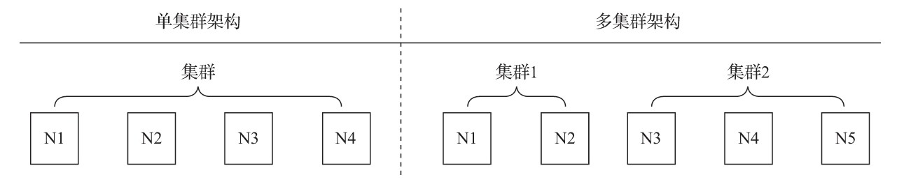
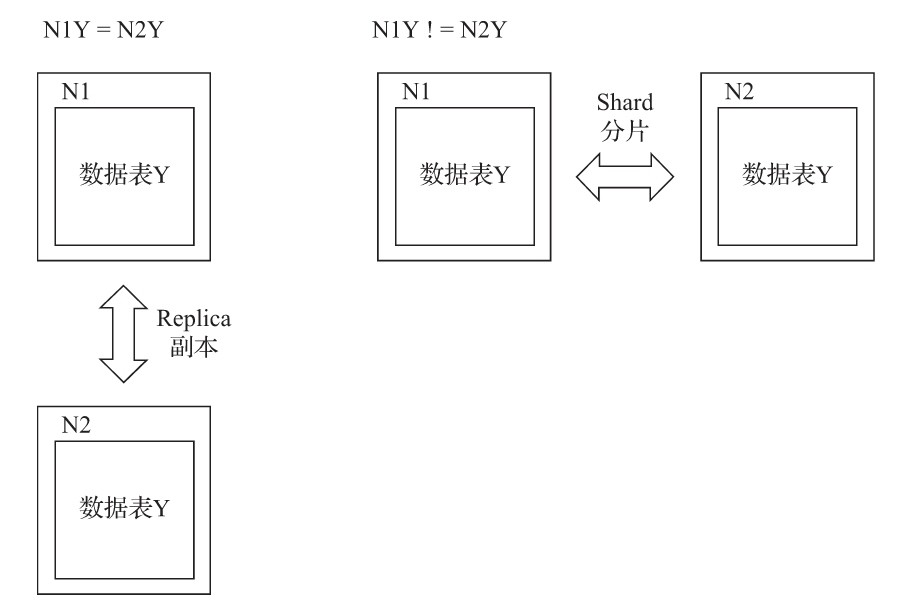

# 副本与分片

摘自：《ClickHouse原理解析与应用实践》 — 朱凯

在豆瓣阅读书店查看：<https://read.douban.com/ebook/149635956/?dcs=bookshelf>

----

纵使单节点性能再强，也会有遇到瓶颈的那一天。业务量的持续增长、服务器的意外故障，都是ClickHouse需要面对的洪水猛兽。常言道，“一个篱笆三个桩，一个好汉三个帮”，而集群、副本与分片，就是ClickHouse的三个“桩”和三个“帮手”。

## 概述

集群是副本和分片的基础，它将ClickHouse的服务拓扑由单节点延伸到多个节点，但它并不像Hadoop生态的某些系统那样，要求所有节点组成一个单一的大集群。ClickHouse的集群配置非常灵活，用户既可以将所有节点组成一个单一集群，也可以按照业务的诉求，把节点划分为多个小的集群。在每个小的集群区域之间，它们的节点、分区和副本数量可以各不相同，如图10-1所示。

从作用来看，ClickHouse集群的工作更多是针对逻辑层面的。集群定义了多个节点的拓扑关系，这些节点在后续服务过程中可能会协同工作，而执行层面的具体工作则交给了副本和分片来执行。

副本和分片这对双胞胎兄弟，有时候看起来泾渭分明，有时候又让人分辨不清。这里有两种区分的方法。

一种是从数据层面区分，假设ClickHouse的N个节点组成了一个集群，在集群的各个节点上，都有一张结构相同的数据表Y。如果N1的Y和N2的Y中的数据完全不同，则N1和N2互为分片；如果它们的数据完全相同，则它们互为副本。换言之，分片之间的数据是不同的，而副本之间的数据是完全相同的。所以抛开表引擎的不同，单纯从数据层面来看，副本和分片有时候只有一线之隔。

另一种是从功能作用层面区分，使用副本的主要目的是防止数据丢失，增加数据存储的冗余；而使用分片的主要目的是实现数据的水平切分，如图10-2所示。

这种形态的变化过程像极了企业内的业务发展过程。在业务初期，我们从单张数据表开始；在业务上线之后，可能会为它增加副本，以保证数据的安全，或者希望进行读写分离；随着业务量的发展，单张数据表可能会遇到瓶颈，此时会进一步为它增加分片，从而实现数据的水平切分。
