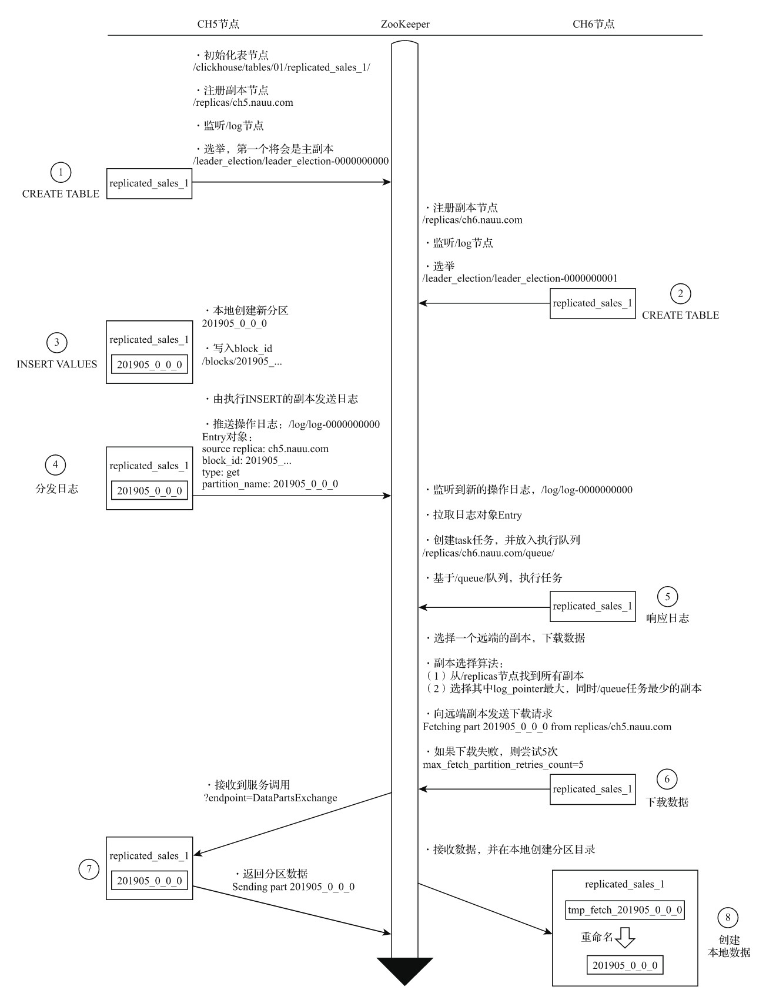
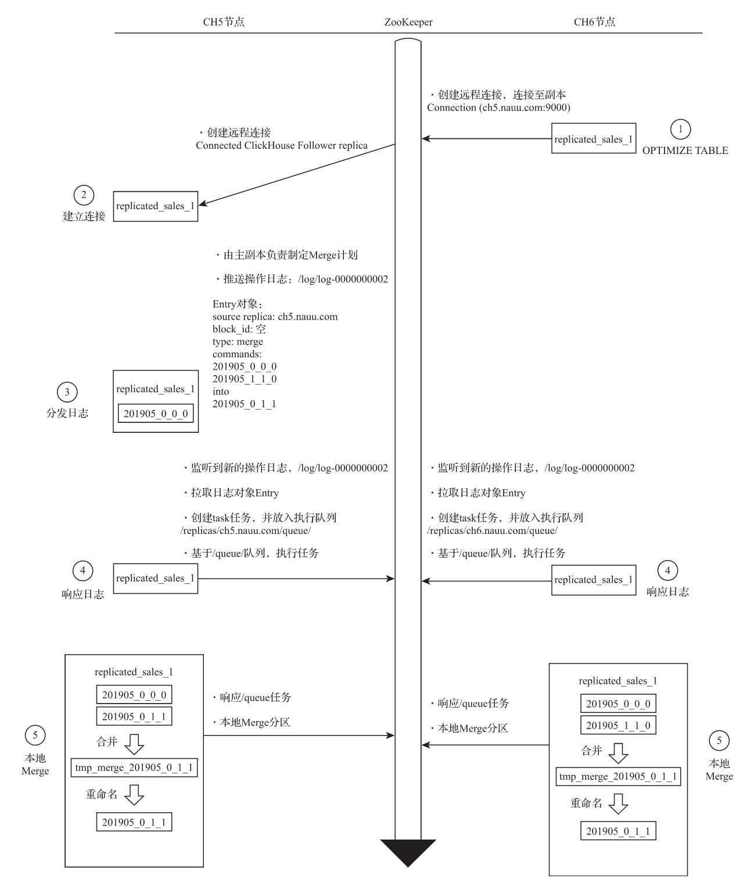
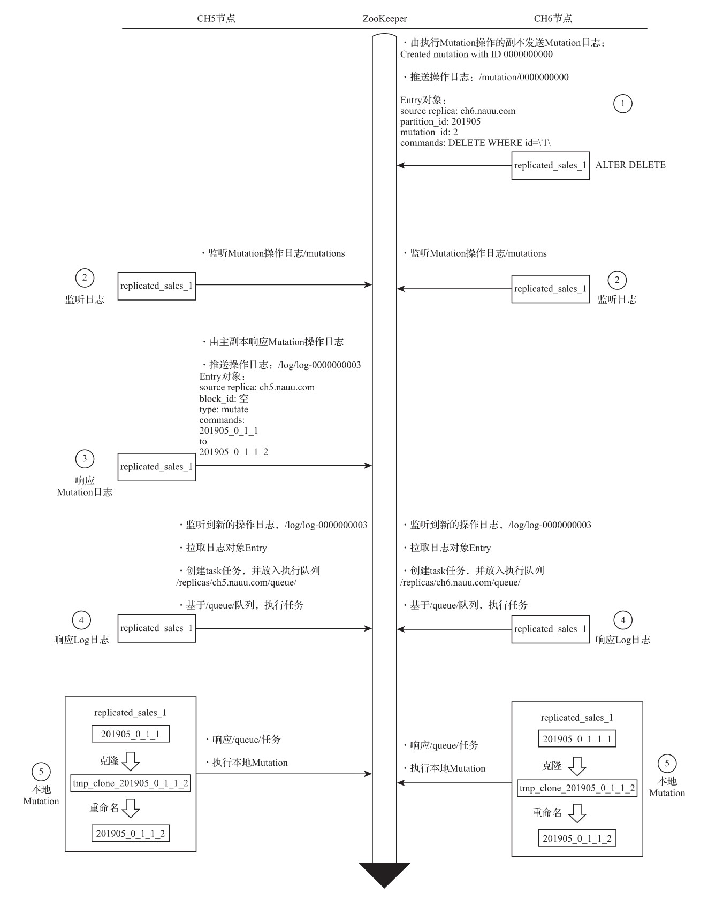
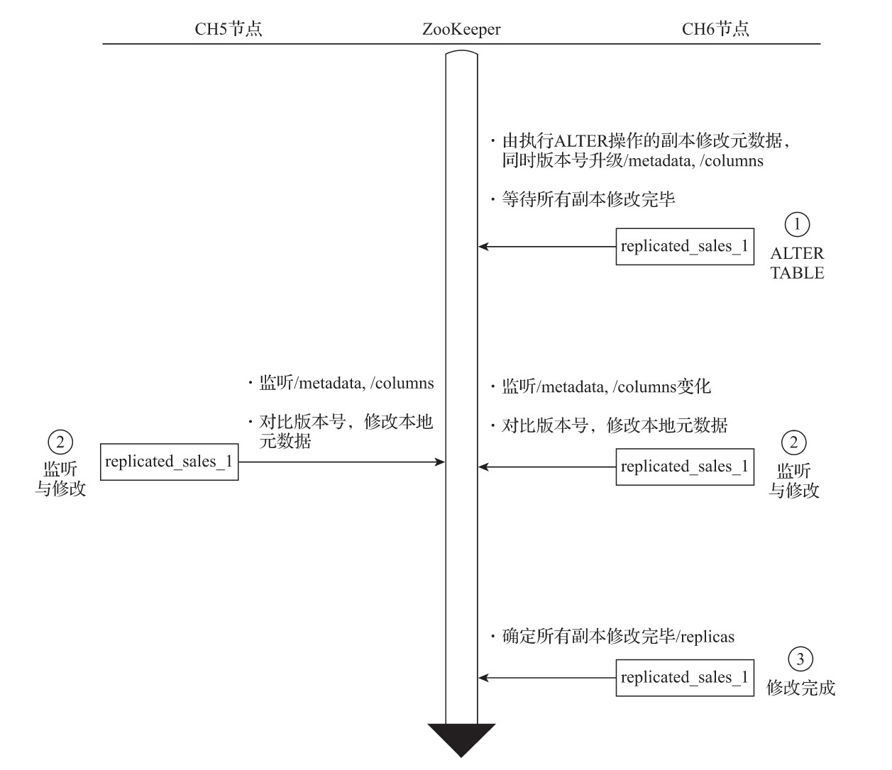

- [ReplicatedMergeTree原理解析](#replicatedmergetree原理解析)
  - [1. 数据结构](#1-数据结构)
    - [1.1 zookeeper内的数据结构](#11-zookeeper内的数据结构)
    - [1.2 Entry日志对象的数据结构](#12-entry日志对象的数据结构)
  - [2. 副本协同的核心流程](#2-副本协同的核心流程)
    - [2.1 INSERT的核心执行流程](#21-insert的核心执行流程)
    - [2.2 MERGE的核心执行流程](#22-merge的核心执行流程)
    - [2.3 MUTATION的核心执行流程](#23-mutation的核心执行流程)
    - [2.4 ALTER的核心执行流程](#24-alter的核心执行流程)

# ReplicatedMergeTree原理解析

ReplicatedMergeTree作为复制表系列的基础表引擎，涵盖了数据副本最为核心的逻辑，将它拿来作为副本的研究标本是最合适不过了。因为只要剖析了ReplicatedMergeTree的核心原理，就能掌握整个ReplicatedMergeTree系列表引擎的使用方法。

## 1. 数据结构

在`ReplicatedMergeTree`的核心逻辑中，大量运用了`ZooKeeper`的能力，以实现多个`ReplicatedMergeTree`副本实例之间的协同，包括主副本选举、副本状态感知、操作日志分发、任务队列和`BlockID`去重判断等。在执行`INSERT`数据写入、`MERGE`分区和`MUTATION`操作的时候，都会涉及与`ZooKeeper`的通信。但是在通信的过程中，并不会涉及任何表数据的传输，在查询数据的时候也不会访问`ZooKeeper`，所以不必过于担心`ZooKeeper`的承载压力。

### 1.1 zookeeper内的数据结构

`ReplicatedMergeTree`需要依靠`ZooKeeper`的事件监听机制以实现各个副本之间的协同。所以，在每张`ReplicatedMergeTree`表的创建过程中，它会以`zk_path`为根路径，在`Zoo-Keeper`中为这张表创建一组监听节点。按照作用的不同，监听节点可以大致分成如下几类：

**元数据**:

- **/metadata**<a name="metadata"></a>：保存元数据信息，包括主键、分区键、采样表达式等。
- **/columns**<a name="columns"></a>：保存列字段信息，包括列名称和数据类型。
- **/replicas**<a name="replicas"></a>：保存副本名称，对应设置参数中的replica_name。

**判断标识**:

- **/leader_election**<a name="leader_election"></a>：用于主副本的选举工作，主副本会主导MERGE和MUTATION操作（ALTER DELETE和ALTER UPDATE）。这些任务在主副本完成之后再借助ZooKeeper将消息事件分发至其他副本。
- **/blocks**<a name="blocks"></a>：记录Block数据块的Hash信息摘要，以及对应的partition_id。通过Hash摘要能够判断Block数据块是否重复；通过partition_id，则能够找到需要同步的数据分区。
- **/block_numbers**<a name="block_numbers"></a>：按照分区的写入顺序，以相同的顺序记录partition_id。各个副本在本地进行MERGE时，都会依照相同的block_numbers顺序进行。
- **/quorum**<a name="quorum"></a>：记录quorum的数量，当至少有quorum数量的副本写入成功后，整个写操作才算成功。quorum的数量由insert_quorum参数控制，默认值为0。

**操作日志**：

- **/log**<a name="log"></a>：常规操作日志节点（INSERT、MERGE和DROP PARTITION），它是整个工作机制中最为重要的一环，保存了副本需要执行的任务指令。log使用了ZooKeeper的持久顺序型节点，每条指令的名称以log-为前缀递增，例如log-0000000000、log-0000000001等。每一个副本实例都会监听/log节点，当有新的指令加入时，它们会把指令加入副本各自的任务队列，并执行任务。关于这方面的执行逻辑，稍后会进一步展开。
- **/mutations**<a name="mutations"></a>：MUTATION操作日志节点，作用与log日志类似，当执行ALER DELETE和ALER UPDATE查询时，操作指令会被添加到这个节点。mutations同样使用了ZooKeeper的持久顺序型节点，但是它的命名没有前缀，每条指令直接以递增数字的形式保存，例如0000000000、0000000001等。关于这方面的执行逻辑，同样稍后展开。
- **/replicas/{replica_name}/\***<a name="replicas"></a>：每个副本各自的节点下的一组监听节点，用于指导副本在本地执行具体的任务指令，其中较为重要的节点有如下几个：
- **/queue**<a name="queue"></a>：任务队列节点，用于执行具体的操作任务。当副本从/log或/mutations节点监听到操作指令时，会将执行任务添加至该节点下，并基于队列执行。
- **/log_pointer**<a name="log_pointer"></a>：log日志指针节点，记录了最后一次执行的log日志下标信息，例如log_pointer：4对应了/log/log-0000000003（从0开始计数）。
- **/mutation_pointer**<a name="mutation_pointer"></a>：mutations日志指针节点，记录了最后一次执行的mutations日志名称，例如mutation_pointer：0000000000对应了/mutations/000000000。

### 1.2 Entry日志对象的数据结构

`ReplicatedMergeTree`在`ZooKeeper`中有两组非常重要的父节点，那就是[/log](#log)和[/mutations](#mutations)。它们的作用犹如一座通信塔，是分发操作指令的信息通道，而发送指令的方式，则是为这些父节点添加子节点。所有的副本实例，都会监听父节点的变化，当有子节点被添加时，它们能实时感知。

这些被添加的子节点在`ClickHouse`中被统一抽象为`Entry`对象，而具体实现则由`Log-Entry`和`MutationEntry`对象承载，分别对应[/log](#log)和[/mutations](#mutations)节点。

**LogEntry**:

LogEntry用于封装/log的子节点信息，它拥有如下几个核心属性：

- **source replica**：发送这条Log指令的副本来源，对应replica_name。
- **type**：操作指令类型，主要有get、merge和mutate三种，分别对应从远程副本下载分区、合并分区和MUTATION操作。
- **block_id**：当前分区的BlockID，对应/blocks路径下子节点的名称。
- **partition_name**：当前分区目录的名称。

**MutationEntry**:

MutationEntry用于封装/mutations的子节点信息，它同样拥有如下几个核心属性：

- **source replica**：发送这条MUTATION指令的副本来源，对应replica_name。
- **commands**：操作指令，主要有ALTER DELETE和ALTER UPDATE。
- **mutation_id**：MUTATION操作的版本号。
- **partition_id**：当前分区目录的ID。

## 2. 副本协同的核心流程

副本协同的核心流程主要有`INSERT`、`MERGE`、`MUTATION`和`ALTER`四种，分别对应了*数据写入*、*分区合并*、*数据修改*和*元数据修改*。

`INSERT`和`ALTER`查询是分布式执行的。借助`ZooKeeper`的事件通知机制，多个副本之间会自动进行有效协同，但是它们不会使用`ZooKeeper`存储任何分区数据。

而其他查询并不支持分布式执行，包括`SELECT`、`CREATE`、`DROP`、`RENAME`和`ATTACH`。

例如，为了创建多个副本，我们需要分别登录每个ClickHouse节点，在它们本地执行各自的`CREATE`语句（后面将会介绍如何利用集群配置简化这一操作）。接下来，会依次介绍上述流程的工作机理。

首先，拟定一个演示场景，即使用`ReplicatedMergeTree`实现一张拥有1分片、1副本的数据表，并以此来贯穿整个讲解过程（对于大于1个副本的场景，流程以此类推）。

接着，通过对`ReplicatedMergeTree`分别执行`INSERT`、`MERGE`、`MUTATION`和`ALTER`操作，以此来讲解相应的工作原理。与此同时，通过实际案例，论证工作原理。

### 2.1 INSERT的核心执行流程

当需要在`ReplicatedMergeTree`中执行`INSERT`查询以写入数据时，即会进入`INSERT`核心流程，其整体示意如图所示。

整个流程从上至下按照时间顺序进行，其大致可分成8个步骤。现在，根据图所示编号讲解整个过程。



- 1）创建第一个副本实例

  假设首先从CH5节点开始，对CH5节点执行下面的语句后，会创建第一个副本实例：

    ```sql
    CREATE TABLE replicated_sales_1(
    id String,
    price Float64,
    create_time DateTime
    ) ENGINE =  ReplicatedMergeTree('/clickhouse/tables/01/replicated_sales_1','ch5.nauu.com')
    PARTITION BY toYYYYMM(create_time) 
    ORDER BY id
    ```

    在创建的过程中，ReplicatedMergeTree会进行一些初始化操作，例如：

  - 根据zk_path初始化所有的ZooKeeper节点。
  - 在/replicas/节点下注册自己的副本实例ch5.nauu.com。
  - 启动监听任务，监听/log日志节点。
  - 参与副本选举，选举出主副本，选举的方式是向/leader_election/插入子节点，第一个插入成功的副本就是主副本。

- 2) 创建第二个副本实例

  接着，在CH6节点执行下面的语句，创建第二个副本实例。表结构和zk_path需要与第一个副本相同，而replica_name则需要设置成CH6的域名：

    ```sql
    CREATE TABLE replicated_sales_1(
    -- 相同结构
    ) ENGINE =  ReplicatedMergeTree('/clickhouse/tables/01/replicated_sales_1','ch6.nauu.com')
    -- 相同结构
    ```

  在创建过程中，第二个ReplicatedMergeTree同样会进行一些初始化操作，例如：

  - 在/replicas/节点下注册自己的副本实例ch6.nauu.com。
  - 启动监听任务，监听/log日志节点。
  - 参与副本选举，选举出主副本。在这个例子中，CH5副本成为主副本。

- 3）向第一个副本实例写入数据

  现在尝试向第一个副本CH5写入数据。执行如下命令：

  ```sql
  INSERT INTO TABLE replicated_sales_1 VALUES('A001',100,'2019-05-10 00:00:00')
  ```

  上述命令执行之后，首先会在本地完成分区目录的写入：

  ```sql
  Renaming temporary part tmp_insert_201905_1_1_0 to 201905_0_0_0
  ```

  接着向/blocks节点写入该数据分区的block_id：

  ```sql
  Wrote block with ID '201905_2955817577822961065_12656761735954722499'
  ```

  该block_id将作为后续去重操作的判断依据。如果此时再次执行刚才的INSERT语句，试图写入重复数据，则会出现如下提示：

  ```sql
  Block with ID 201905_2955817577822961065_12656761735954722499 already exists; ignoring it.
  ```

  即副本会自动忽略block_id重复的待写入数据。

  此外，如果设置了insert_quorum参数（默认为0），并且insert_quorum>=2，则CH5会进一步监控已完成写入操作的副本个数，只有当写入副本个数大于或等于insert_quorum时，整个写入操作才算成功。

- 4）由第一个副本实例推送Log日志

  在3步骤完成之后，会继续由执行了INSERT的副本向/log节点推送操作日志。在这个例子中，会由第一个副本CH5担此重任。日志的编号是/log/log-0000000000，而LogEntry的核心属性如下：

  ```sql
  /log/log-0000000000
  source replica: ch5.nauu.com
  block_id:  201905_...
  type :   get
  partition_name :201905_0_0_0
  ```

- 5) 第二个副本实例拉取Log日志

  CH6副本会一直监听/log节点变化，当CH5推送了/log/log-0000000000之后，CH6便会触发日志的拉取任务并更新log_pointer，将其指向最新日志下标：

  ```sql
  /replicas/ch6.nauu.com/log_pointer : 0
  ```

  在拉取了LogEntry之后，它并不会直接执行，而是将其转为任务对象放至队列：

  ```sql
  /replicas/ch6.nauu.com/queue/
  Pulling 1 entries to queue: log-0000000000 - log-0000000000
  ```

  这是因为在复杂的情况下，考虑到在同一时段内，会连续收到许多个LogEntry，所以使用队列的形式消化任务是一种更为合理的设计。注意，拉取的LogEntry是一个区间，这同样也是因为可能会连续收到多个LogEntry。

- 6）第二个副本实例向其他副本发起下载请求

  CH6基于/queue队列开始执行任务。当看到type类型为get的时候，ReplicatedMerge-Tree会明白此时在远端的其他副本中已经成功写入了数据分区，而自己需要同步这些数据。

  CH6上的第二个副本实例会开始选择一个远端的其他副本作为数据的下载来源。远端副本的选择算法大致是这样的：

  1. 从/replicas节点拿到所有的副本节点。
  2. 遍历这些副本，选取其中一个。选取的副本需要拥有最大的log_pointer下标，并且/queue子节点数量最少。log_pointer下标最大，意味着该副本执行的日志最多，数据应该更加完整；而/queue最小，则意味着该副本目前的任务执行负担较小。

  在这个例子中，算法选择的远端副本是CH5。于是，CH6副本向CH5发起了HTTP请求，希望下载分区201905_0_0_0：

  ```sql
  Fetching part 201905_0_0_0 from replicas/ch5.nauu.com
  Sending request to http://ch5.nauu.com:9009/?endpoint=DataPartsExchange
  ```

  如果第一次下载请求失败，在默认情况下，CH6再尝试请求4次，一共会尝试5次（由`max_fetch_partition_retries_count`参数控制，默认为5）。

- 7）第一个副本实例响应数据下载

  CH5的DataPartsExchange端口服务接收到调用请求，在得知对方来意之后，根据参数做出响应，将本地分区201905_0_0_0基于DataPartsExchang的服务响应发送回CH6：

  ```sql
  Sending part 201905_0_0_0
  ```

- 8）第二个副本实例下载数据并完成本地写入

  CH6副本在收到CH5的分区数据后，首先将其写至临时目录：

  ```sql
  tmp_fetch_201905_0_0_0
  ```

  待全部数据接收完成之后，重命名该目录：

  ```sql
  Renaming temporary part tmp_fetch_201905_0_0_0 to 201905_0_0_0
  ```

  至此，整个写入流程结束。

  可以看到，在`INSERT`的写入过程中，`ZooKeeper`不会进行任何实质性的数据传输。本着谁执行谁负责的原则，在这个案例中由CH5首先在本地写入了分区数据。之后，也由这个副本负责发送Log日志，通知其他副本下载数据。如果设置了`insert_quorum`并且`insert_quorum>=2`，则还会由该副本监控完成写入的副本数量。其他副本在接收到Log日志之后，会选择一个最合适的远端副本，点对点地下载分区数据。

### 2.2 MERGE的核心执行流程

当ReplicatedMergeTree触发分区合并动作时，即会进入这个部分的流程，它的核心流程如图所示。



无论MERGE操作从哪个副本发起，其合并计划都会交由主副本来制定。在INSERT的例子中，CH5节点已经成功竞选为主副本，所以为了方便论证，这个案例就从CH6节点开始。整个流程从上至下按照时间顺序进行，其大致分成5个步骤。现在，根据图中所示编号讲解整个过程。

- 1）创建远程连接，尝试与主副本通信

  首先在CH6节点执行OPTIMIZE，强制触发MERGE合并。这个时候，CH6通过/replicas找到主副本CH5，并尝试建立与它的远程连接。

  ```sql
  optimize table replicated_sales_1
  Connection (ch5.nauu.com:9000): Connecting. Database: default. User: default
  ```

- 2）主副本接收通信

  主副本CH5接收并建立来自远端副本CH6的连接。

  ```sql
  Connected ClickHouse Follower replica version 19.17.0, revision: 54428, database: default, user: default.
  ```

- 3）由主副本制定MERGE计划并推送Log日志

  由主副本CH5制定MERGE计划，并判断哪些分区需要被合并。在选定之后，CH5将合并计划转换为Log日志对象并推送Log日志，以通知所有副本开始合并。日志的核心信息如下：

    ```log
    /log/log-0000000002
    source replica: ch5.nauu.com
    block_id:  
    type :   merge
    201905_0_0_0
    201905_1_1_0
    into
    201905_0_1_1
    ```

  从日志内容中可以看出，操作类型为Merge合并，而这次需要合并的分区目录是201905_0_0_0和201905_1_1_0。
  
  与此同时，主副本还会锁住执行线程，对日志的接收情况进行监听：
  
  ```sql
  Waiting for queue-0000000002 to disappear from ch5.nauu.com queue
  ```

  其监听行为由`replication_alter_partitions_sync`参数控制，默认值为`1`。当此参数为0时，不做任何等待；为`1`时，只等待主副本自身完成；为`2`时，会等待所有副本拉取完成。

- 4）各个副本分别拉取Log日志

  CH5和CH6两个副本实例将分别监听/log/log-0000000002日志的推送，它们也会分别拉取日志到本地，并推送到各自的/queue任务队列：

  ```sql
  Pulling 1 entries to queue: log-0000000002 - log-0000000002
  ```

- 5）各个副本分别在本地执行MERGE

  CH5和CH6基于各自的/queue队列开始执行任务：

  ```sql
  Executing log entry to merge parts 201905_0_0_0, 201905_1_1_0 to 201905_0_1_1
  ```

  各个副本开始在本地执行MERGE：

  ```sql
  Merged 2 parts: from 201905_0_0_0 to 201905_1_1_0
  ```

  至此，整个合并流程结束。

可以看到，**在MERGE的合并过程中，ZooKeeper也不会进行任何实质性的数据传输，所有的合并操作，最终都是由各个副本在本地完成的**。

**而无论合并动作在哪个副本被触发，都会首先被转交至主副本，再由主副本负责合并计划的制定、消息日志的推送以及对日志接收情况的监控。**

### 2.3 MUTATION的核心执行流程

当对ReplicatedMergeTree执行ALTER DELETE或者ALTER UPDATE操作的时候，即会进入MUTATION部分的逻辑，它的核心流程如图10-8所示。

与MERGE类似，无论MUTATION操作从哪个副本发起，首先都会由主副本进行响应。所以为了方便论证，这个案例还是继续从CH6节点开始（因为CH6不是主副本）。整个流程从上至下按照时间顺序进行，其大致分成5个步骤。现在根据图10-8中所示编号讲解整个过程。



- 1）推送MUTATION日志

  在CH6节点尝试通过DELETE来删除数据（执行UPDATE的效果与此相同），执行如下命令：

  ```sql
  ALTER TABLE replicated_sales_1 DELETE WHERE id = '1'
  ```

  执行之后，该副本会接着进行两个重要事项：

  - 创建MUTATION ID：

    ```sql
    Created mutation with ID 0000000000
    ```

  - 将MUTATION操作转换为MutationEntry日志，并推送到/mutations/0000000000。MutationEntry的核心属性如下：

    ```sql
    /mutations/0000000000
    source replica: ch6.nauu.com
    mutation_id:  2
    partition_id: 201905
    commands: DELETE WHERE id = \'1\'
    ```

  由此也能知晓，MUTATION的操作日志是经由/mutations节点分发至各个副本的。

- 2）所有副本实例各自监听MUTATION日志

  CH5和CH6都会监听/mutations节点，所以一旦有新的日志子节点加入，它们都能实时感知：

  ```sql
  Loading 1 mutation entries: 0000000000 – 0000000000
  ```

  当监听到有新的MUTATION日志加入时，并不是所有副本都会直接做出响应，它们首先会判断自己是否为主副本。

- 3）由主副本实例响应MUTATION日志并推送Log日志

  只有主副本才会响应MUTATION日志，在这个例子中主副本为CH5，所以CH5将MUTATION日志转换为LogEntry日志并推送至/log节点，以通知各个副本执行具体的操作。日志的核心信息如下：

  ```sql
  /log/log-0000000003
   source replica: ch5.nauu.com
   block_id:  
   type :   mutate
   201905_0_1_1
   to
   201905_0_1_1_2
  ```

  从日志内容中可以看出，上述操作的类型为mutate，而这次需要将201905_0_1_1分区修改为201905_0_1_1_2(201905_0_1_1 +"_" + mutation_id)。

- 4）各个副本实例分别拉取Log日志

  CH5和CH6两个副本分别监听/log/log-0000000003日志的推送，它们也会分别拉取日志到本地，并推送到各自的/queue任务队列：

  ```sql
  Pulling 1 entries to queue: log-0000000003 - log-0000000003
  ```

- 5）各个副本实例分别在本地执行MUTATION

  CH5和CH6基于各自的/queue队列开始执行任务：

  ```sql
  Executing log entry to mutate part 201905_0_1_1 to 201905_0_1_1_2
  ```

  各个副本，开始在本地执行MUTATION：

  ```sql
  Cloning part 201905_0_1_1 to tmp_clone_201905_0_1_1_2
  Renaming temporary part tmp_clone_201905_0_1_1_2 to 201905_0_1_1_2.
  ```

  至此，整个MUTATION流程结束。

可以看到，在MUTATION的整个执行过程中，ZooKeeper同样不会进行任何实质性的数据传输。所有的MUTATION操作，最终都是由各个副本在本地完成的。而MUTATION操作是经过[/mutations](#mutations)节点实现分发的。

本着谁执行谁负责的原则，在这个案例中由CH6负责了消息的推送。但是无论MUTATION动作从哪个副本被触发，之后都会被转交至主副本，再由主副本负责推送Log日志，以通知各个副本执行最终的MUTATION逻辑。同时也由主副本对日志接收的情况实行监控。

### 2.4 ALTER的核心执行流程

当对ReplicatedMergeTree执行ALTER操作进行元数据修改的时候，即会进入ALTER部分的逻辑，例如增加、删除表字段等。而ALTER的核心流程如图所示。

与之前的几个流程相比，ALTET的流程会简单很多，其执行过程中并不会涉及/log日志的分发。整个流程从上至下按照时间顺序进行，其大致分成3个步骤。现在根据图中所示编号讲解整个过程。



- 1）修改共享元数据

  在CH6节点尝试增加一个列字段，执行如下语句：

  ```sql
  ALTER TABLE replicated_sales_1 ADD COLUMN id2 String
  ```

  执行之后，CH6会修改ZooKeeper内的共享元数据节点：

  ```sql
  /metadata, /columns
  Updated shared metadata nodes in ZooKeeper. Waiting for replicas to apply changes.
  ```

  数据修改后，节点的版本号也会同时提升：

  ```sql
  Version of metadata nodes in ZooKeeper changed. Waiting for structure write lock.
  ```
  
  与此同时，CH6还会负责监听所有副本的修改完成情况：

  ```sql
  Waiting for ch5.nauu.com to apply changes
  Waiting for ch6.nauu.com to apply changes
  ```

- 2）监听共享元数据变更并各自执行本地修改

  CH5和CH6两个副本分别监听共享元数据的变更。之后，它们会分别对本地的元数据版本号与共享版本号进行对比。在这个案例中，它们会发现本地版本号低于共享版本号，于是它们开始在各自的本地执行更新操作：

  ```sql
  Metadata changed in ZooKeeper. Applying changes locally.
  Applied changes to the metadata of the table.
  ```

- 3）确认所有副本完成修改

  CH6确认所有副本均已完成修改：

  ```sql
  ALTER finished
  Done processing query
  ```

  至此，整个ALTER流程结束。

可以看到，在ALTER整个的执行过程中，ZooKeeper不会进行任何实质性的数据传输。所有的ALTER操作，最终都是由各个副本在本地完成的。

本着谁执行谁负责的原则，在这个案例中由CH6负责对共享元数据的修改以及对各个副本修改进度的监控。
